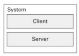
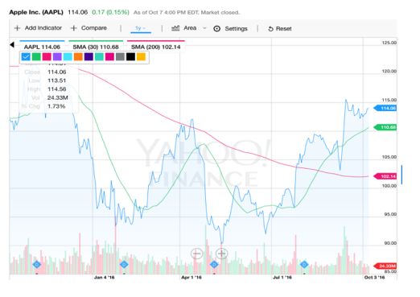

# 1. Existem três formas de caracterizar a manutenção de um sistema: Manutenção Perfeccionista, Manutenção Adaptativa e Manutenção Corretiva (Perfective maintenance, Adaptive maintenance, Corrective maintenance). Escolha duas e explique em que consistem.

**Manutenção Perfeccionista**: Esta forma de manutenção foca-se na melhoria contínua do sistema, mesmo quando ele já está a funcionar corretamente. O objetivo é otimizar o desempenho, adicionar novas funcionalidades ou melhorar a usabilidade com base no feedback dos utilizadores e nas tendências tecnológicas.

**Manutenção Adaptativa**: Esta forma de manutenção envolve a modificação do sistema para que ele possa continuar a funcionar em ambientes em mudança. Isso pode incluir atualizações para compatibilidade com novos sistemas operativos, hardware ou outras dependências externas que evoluem ao longo do tempo.

**Manutenção Corretiva**: Esta forma de manutenção é focada na correção de defeitos ou falhas que surgem no sistema após a sua implementação. O objetivo é restaurar o sistema ao seu estado funcional original, garantindo que ele opere conforme esperado.

# 2. O software é algo intangível, o que faz com que a medição de progresso seja uma tarefa delicada. Indique duas estratégias para observação do progresso num projeto, justificando.

**Entregas de funcionalidades**: Acompanhar o progresso através das funcionalidades entregues permite uma visão concreta do que foi desenvolvido e está disponível para uso, facilitando a avaliação do avanço do projeto.

**Reuniões de acompanhamento**: Realizar reuniões periódicas com a equipa permite discutir o progresso, identificar obstáculos e ajustar planos, promovendo uma comunicação eficaz e uma visão clara do estado do projeto.

# 3. A manutenibilidade (maintainability) é um conceito de qualidade que agrega vários subconceitos. Escolha dois e explique em que consistem.

**Modularidade**: Refere-se à decomposição do sistema em componentes ou módulos independentes, facilitando a compreensão, manutenção e atualização do sistema. Módulos bem definidos permitem que alterações sejam feitas em partes específicas sem afetar o sistema como um todo.

**Testabilidade**: Diz respeito à facilidade com que um sistema pode ser testado para garantir que ele funciona corretamente. Um sistema testável permite a identificação rápida de defeitos e a verificação eficaz das funcionalidades, o que é crucial para a manutenção e evolução do software.

# 4. Explique qual a ideia-chave em que assenta a medida de complexidade ciclomática (cyclomatic complexity); não se esqueça de referir o que esta medida aproxima.

A complexidade ciclomática é uma métrica que quantifica a complexidade de um programa de acordo com o seu grau de ramificações lógicas e aproxima o número de caminhos independentes. Isto é um bom indicador para o esforço de teste, compreensão e manutenção do código, pois quanto maior a complexidade ciclomática, maior é a probabilidade de erros e dificuldades na manutenção.

# 5. O seguinte diagrama representa uma vista de módulos de um sistema (System) com um módulo cliente (Client) e um módulo servidor (Server). Indique qual o estilo representado, qual o tipo de relação, e quaisquer restrições que eventualmente existam neste estilo (caso considere que não existem restrições, explicite-o).



O estilo apresentado é o estilo Cliente-Servidor. A relação entre os módulos é de comunicação direta, onde o módulo Cliente faz pedidos ao módulo Servidor, que processa esses pedidos e devolve respostas, introduzindo uma relação de dependência entre o cliente e o servidor.

Isto leva a algumas restrições, tais como:

- **Dependência do Servidor**: O Cliente depende, totalmente, do Servidor para obter respostas, o que pode criar um ponto único de falha se o Servidor estiver indisponível.
- **Escalabilidade Limitada**: A capacidade do sistema pode ser limitada pela capacidade do Servidor, o que pode levar a gargalos de desempenho se muitos Clientes fizerem pedidos simultaneamente.

# 6.Considere um sistema com 2 servidores com diferentes disponibilidades e taxas de serviço (pedidos/unidade de tempo):

```
Servidor1: a1 (disponibilidade), s1 (taxa de serviço)
Servidor2: a2 (disponibilidade), s2 (taxa de serviço)

Onde s1<s2. Os pedidos de um Cliente são enviados para o Servidor1 em primeira instância, que dará uma resposta ao pedido caso esteja disponível.

Caso este não esteja disponível, o pedido é reencaminhado para o Servidor2, que de igual modo dará uma resposta ao pedido caso esteja disponível.
```

## Considerando apenas as situações em que uma resposta é obtida, calcule o tempo médio que o Cliente demora a receber uma resposta.

O tempo médio que o Cliente demora a receber uma resposta pode ser calculado considerando as probabilidades de disponibilidade dos servidores e os tempos de serviço associados a cada um.

Temos as seguintes situações:

1. O Servidor1 está disponível.
    - Probabilidade: a1
    - Tempo de resposta: 1/s1
2. O Servidor1 não está disponível, mas o Servidor2 está disponível.
    - Probabilidade: (1 - a1) * a2
    - Tempo de resposta: 1/s2
3. Ambos os servidores não estão disponíveis.
    - Probabilidade: (1 - a1) * (1 - a2)
    - Tempo de resposta: Não aplicável, pois não há resposta.
  
Possibilidade de obter uma resposta:
P(resposta) = a1 + (1 - a1) * a2

Tempo médio de resposta (T) pode ser calculado como:
T = (a1 * (1/s1) + (1 - a1) * a2 * (1/s2)) / P(resposta)

# 7. Pretende-se desenvolver um sistema StockTrend que a partir de um fluxo contínuo de cotações em bolsa de um conjunto de títulos calcula a tendência (de subida ou descida) tendo em conta os valores de SMA30 e SMA200 (simple moving average).



## a) Indique um estilo arquitetónico que considere apropriado para usar neste sistema. Descreva, em abstrato, esse estilo (nomeadamente o tipo de componentes e conectores, e o modelo de computação) e as principais vantagens e desvantagens que lhe estão associadas. 

O estilo adequado para o sistema StockTrend é o estilo Pipe-and-Filter. Este estilo é caracterizado por componentes chamados "filtros" que processam dados e conectores chamados "pipes" que transmitem os dados entre os filtros.

Os principais componentes para estes sistema seriam:

- **Filtros**: Componentes que realizam operações específicas, como a leitura das cotações, o cálculo das médias móveis (SMA30 e SMA200) e a determinação da tendência.
- **Pipes**: Conectores que transportam os dados entre os filtros, permitindo a passagem contínua de informações.
- **Modelo de Computação**: O sistema processa de forma contínua e incremental os dados à medida que estes são recebidos, permitindo uma análise em tempo real.

As principais vantagens deste estilo incluem:

- **Modularidade**: Cada filtro pode ser desenvolvido, testado e mantido independentemente.
- **Reutilização**: Filtros podem ser reutilizados em diferentes sistemas ou contextos.
- **Facilidade de Manutenção**: Alterações em um filtro não afetam outros filtros, desde que as interfaces permaneçam consistentes.
- **Escalabilidade**: Novos filtros podem ser adicionados facilmente para estender a funcionalidade do sistema.

As principais desvantagens incluem:

- **Latência**: A passagem de dados através de múltiplos filtros pode introduzir atrasos.
- **Complexidade de Configuração**: A configuração dos pipes e filtros pode ser complexa, especialmente em sistemas grandes.
- **Sobrecarga de Comunicação**: A comunicação entre filtros pode introduzir sobrecarga, especialmente se os dados forem grandes ou se houver muitos filtros.

## b) Conceba uma arquitetura para o sistema baseada nesse estilo. Apresente uma vista de componentes e conectores que descreva a organização geral do sistema em tempo de execução, não esquecendo de (i) incluir uma legenda e (ii) descrever minimamente todos os elementos envolvidos no(s) diagrama(s) que apresentar.

```
┌──────────────────────┐
│   Market Data Source │
│ (Fluxo de cotações)  │
└───────────┬──────────┘
            │ Pipe (stream)
            ▼
┌──────────────────────┐
│  Ingestion Filter    │
│ (normalização /      │
│ validação dos dados) │
└───────────┬──────────┘
            │ Pipe
            ▼
┌──────────────────────┐
│   SMA30 Filter       │
│ (cálculo média móvel │
│ de 30 períodos)      │
└───────────┬──────────┘
            │ Pipe
            ▼
┌──────────────────────┐
│   SMA200 Filter      │
│ (cálculo média móvel │
│ de 200 períodos)     │
└───────────┬──────────┘
            │ Pipe
            ▼
┌──────────────────────┐
│ Trend Detection      │
│ Filter               │
│ (comparação SMA30    │
│ vs SMA200)           │
└───────────┬──────────┘
            │ Pipe
            ▼
┌──────────────────────┐
│   Output / Sink      │
│ (armazenamento,      │
│ visualização ou API) │
└──────────────────────┘
```

## c) Explique qual a estrutura típica de um cenário de qualidade e indique as vantagens de usar estes cenários para exprimir os requisitos relativamente aos atributos de qualidade. 

A estrutura típica de um cenário de qualidade inclui os seguintes elementos:

- **Fonte de Estímulo**: Quem ou o que gera o estímulo.
- **Estímulo**: A condição ou evento que desencadeia o cenário.
- **Artefacto**: A parte do sistema que é afetada pelo estímulo.
- **Ambiente**: O contexto em que o estímulo ocorre.
- **Resposta**: O comportamento esperado do sistema em resposta ao estímulo.
- **Medida**: A métrica usada para avaliar se a resposta atende aos requisitos de qualidade.

As vantagens de usar cenários de qualidade incluem:

- **Clareza**: Fornecem uma descrição clara e detalhada dos requisitos de qualidade, facilitando a compreensão por todas as partes interessadas.
- **Comunicação**: Ajudam a comunicar expectativas de qualidade entre desenvolvedores, gestores e clientes.
- **Avaliação**: Permitem a avaliação objetiva do sistema em relação aos requisitos de qualidade.
- **Foco**: Ajudam a focar o desenvolvimento em aspectos críticos de qualidade, garantindo que estes sejam considerados desde o início do projeto.

## d) Escreva um cenário de qualidade para o StockTrend, endereçando o tempo de resposta.

- **Fonte de Estímulo**: Utilizador do sistema StockTrend.
- **Estímulo**: Pedido de análise de tendência após a receção de novas cotações.
- **Artefacto**: Componente de Trend Detection Filter.
- **Ambiente**: Sistema em operação normal com fluxo contínuo de cotações.
- **Resposta**: O sistema calcula e devolve a tendência (subida ou descida) com base nas médias móveis SMA30 e SMA200.
- **Medida**: O tempo de resposta não deve exceder 2 segundos após a receção das novas cotações.
