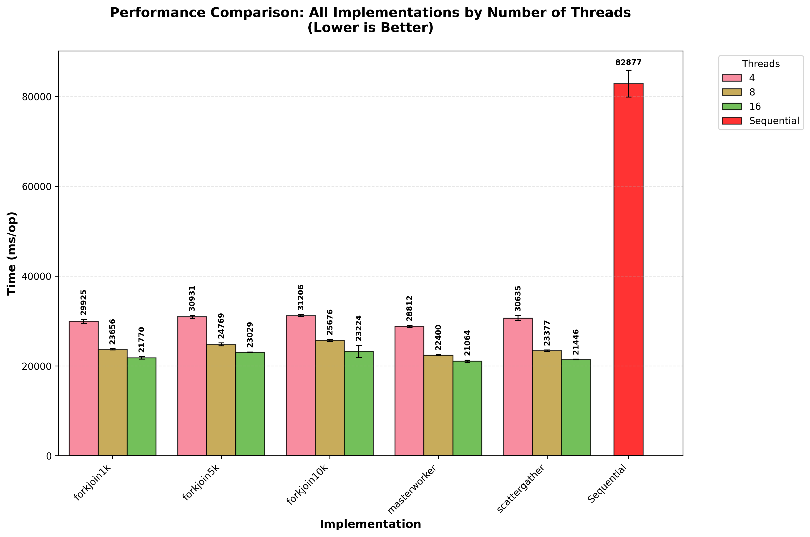
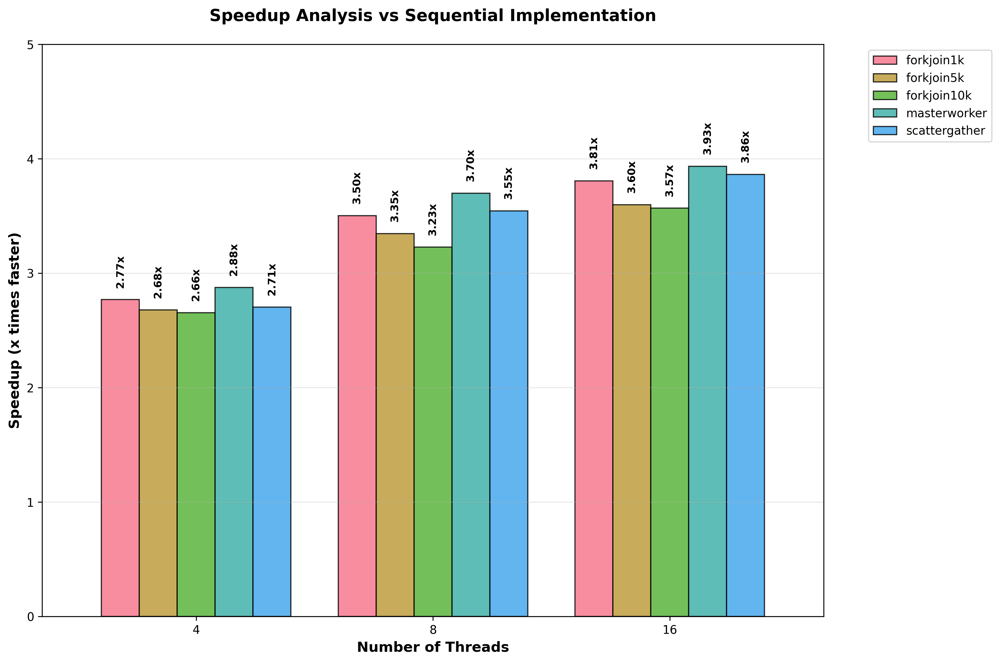
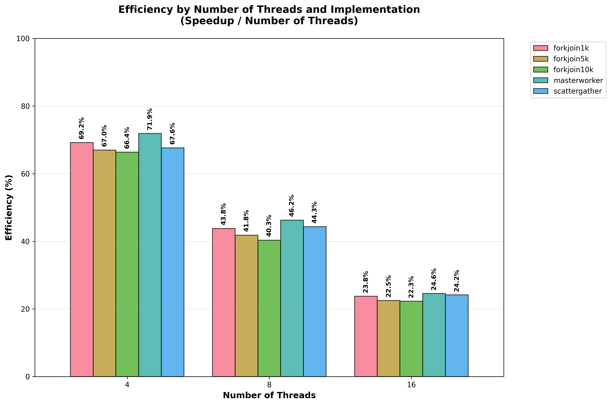

# Assignment #1: Algorithm for the Knapsack Problem

## What were the parallelization strategies used? How did you implement them and why?

In this assignment, three distinct parallelization strategies were implemented:

1. **Master-Worker Pattern with Poison Pill**
2. **Scatter-Gather Pattern**
3. **Fork-Join Pattern**

All these strategies apply parallelization to each generation step of the algorithm, specifically targeting the methods that evaluate the fitness of individuals in the population. This focus is strategic since fitness evaluation is the most computationally intensive task and benefits significantly from parallel execution.

### Master-Worker Pattern with Poison Pill

The Master-Worker uses a master thread to be responsible for distributing tasks to multiple worker threads. This implementation creates a thread pool with a configurable number of workers (`maxThreads` parameter, defaulting to `Runtime.getRuntime().availableProcessors()`). The master divides the population into equal chunks based on a calculated chunk size (`POP_SIZE / maxThreads`), ensuring balanced workload distribution among workers.

The implementation consists of three key components:

**Core Classes:**

- `Worker` class that implements `Runnable` - represents a worker thread that continuously polls the task queue for work
- `Task` class - encapsulates the work to be performed, containing a `TaskType` and a `Runnable` with the actual logic
- `TaskType` enum - distinguishes between regular tasks (`RUNNABLE`) and termination signals (`POISON_PILL`)

**Architecture:**
The master maintains a thread-safe `LinkedBlockingQueue<Task>` that serves as the communication channel between the master and workers. Workers are initialized once at the beginning of the algorithm and remain active throughout all generations, continuously processing tasks as they become available.

**Parallelized Operations:**
This pattern is applied to four critical algorithm operations:

1. **Fitness Calculation** (`calculateFitness()`): Each worker evaluates the fitness of individuals in its assigned chunk of the population
2. **Best Individual Selection** (`bestOfPopulation()`): Workers find the best individual in their chunk using `AtomicReference` with compare-and-swap operations to safely update the global best
3. **Population Reproduction** (`calculateBestPopulation()`): Workers perform tournament selection and crossover operations to generate new individuals
4. **Mutation** (`mutate()`): Workers apply mutation to individuals in their assigned range based on the mutation probability

**Synchronization:**
Each parallelized step utilizes a `CountDownLatch` initialized with the number of workers. As each worker completes its assigned chunk of work, it calls `countDown()`, while the master waits using `await()` before proceeding to the next step. This mechanism ensures proper synchronization between generations.

**Lifecycle Management:**
Workers are initialized once at the beginning (`startWorkers()`) and terminated at the end by enqueueing a poison pill for each worker (`stopWorkers()`). This approach minimizes thread creation overhead and maintains consistent performance across generations.

### Scatter-Gather Pattern

The Scatter-Gather pattern divides the population into smaller chunks (scattered) across multiple threads for parallel processing, then collects the results (gathered) after completion. This implementation utilizes Java's `ExecutorService` with a fixed thread pool to manage parallel execution efficiently.

**Core Architecture:**

- Utilizes `Executors.newFixedThreadPool(maxThreads)` where `maxThreads` is a configurable parameter (defaulting to `Runtime.getRuntime().availableProcessors()`)
- Employs a centralized `computeFutures()` method that handles the scatter-gather logic for all parallelized operations
- Creates `Future` objects to track and synchronize the completion of parallel tasks

**Scatter Phase:**
The `computeFutures()` method divides the work range into equal chunks based on `chunkSize = total operations / maxThreads`. Each thread receives a specific range to process:

- Thread 0: processes indices `[start, start + chunkSize)`
- Thread 1: processes indices `[start + chunkSize, start + 2 * chunkSize)`
- Last thread: processes remaining indices to handle any remainder from integer division

**Gather Phase:**
After submitting all tasks to the thread pool, the method calls `futures.forEach { it.get() }` to wait for all threads to complete their work before proceeding. This ensures synchronization between parallel operations.

**Parallelized Operations:**

1. **Fitness Calculation** (`calculateFitness()`): Each thread evaluates fitness for individuals in its assigned range
2. **Best Individual Selection** (`bestOfPopulation()`): Threads find local best individuals and use `AtomicReference` with compare-and-swap to update the global best
3. **Population Reproduction** (`calculateBestPopulation()`): Each thread performs tournament selection and crossover for its assigned range
4. **Mutation** (`mutate()`): Threads apply mutation to individuals in their assigned range based on mutation probability

**Thread Management:**
The thread pool is created once per algorithm execution and reused across all generations, minimizing thread creation overhead. The pool is properly shut down in a `finally` block to ensure resource cleanup.

### Fork-Join Pattern

The Fork-Join pattern utilizes Java's Fork-Join framework to recursively divide tasks into smaller subtasks until they reach a manageable size (threshold), then processes them in parallel and combines the results. This implementation leverages `ForkJoinPool` and `RecursiveAction` to achieve work-stealing parallelism.

**Core Architecture:**

- Utilizes `ForkJoinPool(maxThreads)` where `maxThreads` is a configurable parameter (defaulting to `Runtime.getRuntime().availableProcessors()`)
- Implements `RecursiveAction` for each algorithm operation requiring parallelization
- Employs a configurable threshold (default 1000) to determine when to stop subdividing tasks
- Uses `invokeAll()` to fork subtasks and automatically join their results

**Fork Phase (Task Subdivision):**
The `computeRange()` method implements the recursive subdivision logic:

- If the work range `(end - start)` is smaller than or equal to the threshold, executes the task directly
- Otherwise, splits the range in half at the midpoint: `mid = (start + end) / 2`
- Creates two `RecursiveAction` subtasks: left half `[start, mid)` and right half `[mid, end)`
- Uses `invokeAll(left, right)` to fork both subtasks for parallel execution

**Join Phase (Result Combination):**
The Fork-Join framework automatically handles the join phase through the `invokeAll()` method, which:

- Executes subtasks in parallel using available worker threads
- Implements work-stealing where idle threads can steal work from busy threads' queues
- Waits for all subtasks to complete before returning control to the caller

**Parallelized Operations:**

1. **Fitness Calculation** (`calculateFitness()`): Recursively divides the population range and evaluates fitness for individuals in parallel
2. **Best Individual Selection** (`bestOfPopulation()`): Finds local best individuals in parallel chunks and uses `AtomicReference` with compare-and-swap to update the global best
3. **Population Reproduction** (`calculateBestPopulation()`): Performs tournament selection and crossover operations in parallel across population segments
4. **Mutation** (`mutate()`): Applies mutation to individuals in parallel based on the mutation probability

**Work-Stealing Benefits:**
The Fork-Join framework provides automatic load balancing through work-stealing, where threads that complete their work early can steal tasks from other threads' work queues, maximizing CPU utilization and minimizing idle time.

**Threshold Optimization:**
The configurable threshold parameter allows fine-tuning the granularity of parallelization - smaller thresholds create more parallelism but increase overhead, while larger thresholds reduce overhead but may limit parallelization opportunities.

## How much better was the performance in parallel, compared to the sequential version?

The parallel implementations demonstrated significant performance improvements compared to the sequential version, with speedups ranging from **2.6x to 3.9x** depending on the implementation strategy and number of threads used.

### Analysis of Performance Results

The performance results can be explained by several key factors related to the nature of the algorithm and the characteristics of each parallelization strategy:

#### Why Master-Worker Performed Best

1. **Configurable Worker Thread Pool**: The implementation creates workers equal to the `maxThreads` parameter (defaulting to `Runtime.getRuntime().availableProcessors()`) that remain active throughout all generations, eliminating thread creation/destruction overhead
2. **LinkedBlockingQueue Efficiency**: The thread-safe `LinkedBlockingQueue<Task>` provides optimal load balancing - workers continuously poll without spinning, and blocking ensures immediate task pickup
3. **Poison Pill Termination**: The elegant `TaskType.POISON_PILL` shutdown mechanism in `stopWorkers()` minimizes synchronization complexity compared to other termination strategies
4. **Chunked Population Processing**: Population division based on `POP_SIZE / maxThreads` ensures consistent memory regions per worker, improving cache locality
5. **CountDownLatch Synchronization**: Each operation uses precise synchronization barriers without unnecessary thread blocking between algorithm steps

#### Fork-Join Threshold Analysis

The threshold parameter significantly impacts performance across different configurations:

1. **1k Threshold Advantages**:
   - Optimal task granularity for algorithm computational intensity
   - Sufficient parallel tasks without excessive `RecursiveAction` creation overhead  
   - Effective work-stealing due to balanced task completion times
   - Better utilization at high thread counts (16 threads)

2. **5k and 10k Threshold Limitations**:
   - Larger chunks create fewer parallel opportunities, especially problematic at 16 threads
   - Less effective work-stealing due to uneven task distribution
   - Underutilization when chunk count < available thread count

3. **Work-Stealing Framework**: The `ForkJoinPool` with `invokeAll()` provides automatic load balancing through work-stealing queues, explaining consistent scaling performance

#### Scatter-Gather Characteristics

1. **Configurable Thread Pool**: `Executors.newFixedThreadPool(maxThreads)` where `maxThreads` is a configurable parameter (defaulting to `Runtime.getRuntime().availableProcessors()`) created once per execution minimizes thread management overhead across generations
2. **Future-Based Coordination**: The `futures.forEach { it.get() }` pattern creates efficient synchronization barriers but requires all threads to complete before proceeding
3. **Static Chunk Distribution**: Equal work distribution (`chunkSize = total operations / maxThreads`) works well for uniform algorithm workloads

#### Efficiency Diminishing Returns Explained

The efficiency pattern follows fundamental parallel computing limitations:

1. **Amdahl's Law**: Sequential algorithm portions (initialization, result collection, synchronization points) become bottlenecks as parallel portions accelerate
2. **Synchronization Overhead Scaling**: `CountDownLatch.await()` and `AtomicReference` compare-and-swap operations become more expensive with increased thread contention
3. **Memory Subsystem Saturation**:
   - Cache consistency overhead increases with thread count
   - Memory bandwidth limits during population array manipulation
   - Potential false sharing in population data structures
4. **Hardware Architecture Limits**: Beyond 8 threads, hyperthreading effects significantly reduce per-thread effectiveness since the experimental setup uses a machine with 8 physical cores and 16 logical processors (hyperthreading enabled). Threads 9-16 share execution units, caches, and pipeline resources with threads 1-8, leading to resource contention rather than true parallelism

#### Algorithm Parallelization Suitability

The excellent speedups result from the algorithm's inherently parallel nature:

1. **Embarrassingly Parallel Operations**:
   - `calculateFitness()`: Independent fitness evaluation per individual
   - `mutate()`: Independent mutation operations based on probability
   - `bestOfPopulation()`: Local searches with atomic global updates
2. **Uniform Computational Load**: Each individual requires similar processing time, granting fairness in workload distribution, preventing load imbalancing
3. **Minimal Shared State**: Operations work on population segments independently, synchronizing only at generation boundaries  
4. **Sequential Memory Access**: Population array processing provides excellent spatial locality for chunked access patterns

#### Implementation-Specific Performance Factors

- **Master-Worker**: Persistent threads + efficient task queue = minimal coordination overhead
- **Fork-Join 1k**: Optimal granularity + recursive work-stealing = superior load balancing  
- **Scatter-Gather**: Simple coordination + thread pool reuse = solid baseline performance
- **Fork-Join 5k/10k**: Suboptimal granularity limits parallelization effectiveness at higher thread counts

### Performance Visualization

The following graphs illustrate the performance analysis results:

*Figure 1: Performance comparison showing execution times (ms/op) for all implementations across different thread counts. Lower values indicate better performance.*

*Figure 2: Speedup analysis comparing all parallel implementations against the sequential baseline. Higher values indicate better parallel performance.*

*Figure 3: Efficiency analysis showing how effectively each implementation utilizes the available threads (Speedup ÷ Number of Threads).*

## What was your experimental setup? Include all relevant details

The experimental setup for evaluating the performance of the algorithm implementations involved the following key components:

- **Hardware**: The machine used for testing is equipped with an AMD Ryzen 7 processor featuring 8 physical cores and 16 logical processors (hyperthreading enabled), along with 16GB of RAM. This configuration allows for testing various thread counts up to 16.
- **Operating System**: The experiments were conducted on a 64-bit version of Windows 11.
- **Java Version**: All implementations were developed and executed using OpenJDK 17.0.16+8.
- **Benchmarking Framework**: The JMH (Java Microbenchmark Harness) was used to ensure accurate and reliable performance measurements using the following configurations for the parallel implementations:
  - Benchmark mode: Average time
  - Output time unit: milliseconds
  - Forks: 3
  - Warm-up iterations: 3 with 2 seconds each
  - Measurement iterations: 5 with 2 seconds each

## Conclusion

This assignment successfully demonstrated the effectiveness of parallel algorithms for the knapsack problem, achieving significant speedups ranging from **2.6x to 3.9x** compared to sequential implementation. The Master-Worker pattern emerged as the optimal approach (3.93x speedup at 16 threads) due to its efficient thread lifecycle management and task distribution via `LinkedBlockingQueue` with poison pill termination.

The results confirm that algorithms are exceptionally well-suited for parallelization, with fitness evaluation being an embarrassingly parallel operation. However, efficiency diminishes with increased thread count (72% at 4 threads to 25% at 16 threads) due to hyperthreading effects, synchronization overhead, and memory subsystem limitations beyond 8 physical cores.

The comprehensive JMH benchmarking and configurable `maxThreads` parameter ensure reliable, reproducible results adaptable to different hardware configurations, providing a solid foundation for tackling computationally intensive optimization problems in production environments.