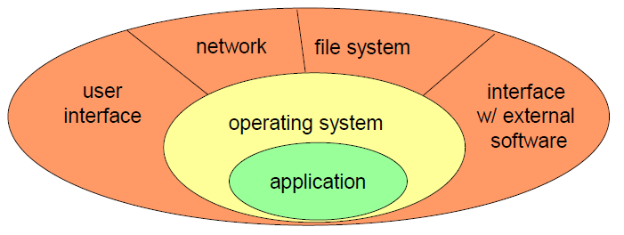

# Basic Concepts

## Main security atributes

The three main attributes of security are often referred to as the CIA triad:

- **Confidentiality**: Ensuring that information is accessible only to those authorized to have access.
- **Integrity**: Safeguarding the accuracy and completeness of information and processing methods.
- **Availability**: Ensuring that authorized users have access to information and associated assets when required.

Other important attributes include:

- **Authenticity**: Ensuring that the information is genuine and from a verified source.
- **Privacy**: Protecting personal information and ensuring that it is not disclosed without consent.

---

# Vulnerability

A vulnerability is a weakness in a system that can be exploited by threats to gain unauthorized access to an asset. Vulnerabilities can arise from various sources, including software bugs, misconfigurations, or human factors.

A vulnerability can be:

- A weakness in an information system, system security
procedures, internal controls, or implementation **that could be
exploited or triggered by a threat source**.
- A weakness in an information system, system security
procedures, internal controls, or implementation **that could be
exploited by a threat source**.
- A weakness in a system, application, or network that is
**subject to exploitation or misuse**.

A **0-day vulnerability** is a vulnerability that is unknown to those who would be interested in mitigating the vulnerability (including the vendor of the target software). Until the vulnerability is mitigated, hackers can exploit it to adversely affect programs, data, additional computers or a network.

More specifically, a **0-day vulnerability** is a vulnerability not publicly known (only a group of people has the knowledge that it exists; sold in dark-web marketplaces).

## Types of vulnerabilities

In general, vulnerabilities can be classified into several types based on their nature and the way they can be exploited. Some common types of vulnerabilities include:

- **Design vulnerabilities**: Flaws in the design of a system or application that can be exploited (e.g., weak authentication mechanism, forget that communication can be listened in the network).
- **Coding vulnerabilities**: Flaws in the implementation of a system or application introducing bugs that can be exploited (e.g., missing end of buffer verification).
- **Operational vulnerabilities**: Weaknesses in the operational procedures caused by the environment in which it is executed or its configuration (e.g., database accounts with empty password).

---

# Attacks and Others

An **attack** is an intentional act that attempts to exploit a vulnerability to compromise the security of a system or network. Attacks can be carried out by individuals, groups, or even automated systems, and they can take various forms, such as malware, phishing, denial of-service (DoS) attacks, and more.

(Attack + Vulnerability) -> Intrusion

An **exploit** is a piece of software, a chunk of data, or a sequence of commands that takes advantage of a vulnerability to cause unintended or unanticipated behavior to occur on computer software, hardware, or something electronic (usually computerized). This frequently includes things like gaining control of a computer system or allowing privilege escalation or a denial-of-service attack. An **exploit** can be also a method or technique used to take advantage of a vulnerability in a system, application, or network. Exploits can be used by attackers to gain unauthorized access, escalate privileges, or cause other types of harm.

A **Patch** is a piece of software designed to update a computer program or its supporting data, to fix or improve it. This includes fixing security vulnerabilities and other bugs, with the intention of improving the usability or performance.

Patches are often temporary solutions to vulnerabilities, and they may not fully resolve the underlying issue. Some reasons why patches may be considered temporary solutions include:

- the user needs to spend effort to apply the patch
- the patch can cause instability in the software execution
- the patch can be reverse engineered to create an exploit.
  
Because of these reasons, patches are often seen as a stopgap measure (temporary solution or quick fix) until a more permanent solution can be implemented, such as a full software update or redesign.

## Attack Vectors

Attack vectors are the paths or means by which an attacker can gain access to a computer or network server in order to deliver a payload or malicious outcome. Understanding attack vectors is crucial for developing effective security measures. Some common attack vectors include:

- Phishing
- Malware
- Brute-force attacks
- Social engineering.

This type of attacks can be directed to a specific target (e.g., a person or a company) or the internet in general (e.g., spear phishing vs. phishing).

This vector can be classified as:

- **Technical attacks**: Target technical vulnerabilities in systems, software, or networks
- **Social engineering attacks**: Target human vulnerabilities through manipulation and deception

Also this vectors can be:

- **Manual attacks**: Involve human intervention to exploit a vulnerability (e.g., a hacker manually entering commands to gain access to a system)
- **Automated attacks**: Use automated tools or scripts to exploit vulnerabilities or send malicious content to a large number of targets (e.g., a botnet launching a distributed denial-of-service (DDoS) attack, or automated phishing campaigns)

## Attack Surfaces

The Attack Surface of a software environment is the sum of the different points where an attacker can try to enter data to or extract data from an environment. To reduce the possible attack vectors, it is important to minimize the attack surface by reducing the number of entry points and potential vulnerabilities in a system. 

