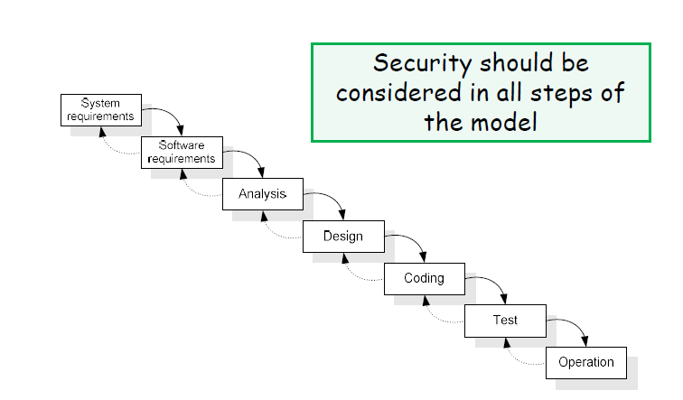
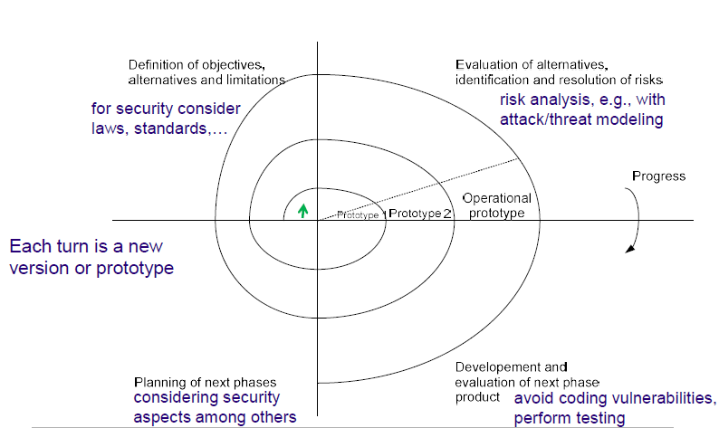

# Software Development

## Security vs. Other Development Goals

The goals of security are often contradictory with other objectives of software development:

- **Functionality**: more is better
- **Usability**: easier the better  
- **Performance**: higher the better
- **Simplicity**: more is better
- **Time-to-market**: faster the better

---

# Risk

Risk is the potential for loss, damage, or destruction of an asset as a result of a threat exploiting a vulnerability. In the context of information security, risk is often assessed based on the likelihood of a threat exploiting a vulnerability and the potential impact of that exploitation. Typically, the objective is (not to achieve 100% security, or 0
vulnerabilities, but) to have an acceptable risk level, which is a balance between the cost of implementing security measures and the potential impact of a security breach.

- **Probability of successful attack** = Threat level x Vulnerability level
- **Risk** = Probability of successful attack x Impact

The Risk depends on the system evironment:

- All software is 100% secure in a computer locked in a safe with no Internet connection
- basic arithmetic: ```T*0*I=0 0*V*I=0 T*V*0=0```


## Factors Affecting the Vulnerability Level

The main factors affecting the vulnerability level are:

- The kinds of vulnerabilities that exist in the software (design/coding/operational)
- The implemented security mechanisms
- Maturity level of the software development processes used in the company like:
  - Code reviews and security assessments
  - Standardized security practices
  - Regular testing and validation
  - Documentation and change control
  - Security training for developers
- Uncertainty of the above factors.

---

# Software Development Life Cycle (SDLC)

A Software Development Life Cycle (SDLC) is a formal or informal **methodology** for **designing**, **creating**, and **maintaining** software. 
Many SDLC models do **not** address software security, but it is important to consider security at every phase of the SDLC to ensure that the software is secure and resilient against potential threats.

Secure software development practices usually need to be added to and integrated within each SDLC model to ensure the software being developed under that model is well-secured.

## Waterfall Model

The Waterfall Model is a linear and sequential approach to software development. In this model, each phase must be completed before the next phase can begin. The phases typically include:

1. **System Requirements**: Define the overall system requirements, including hardware and software specifications.
2. **Software Requirements**: Specify the software requirements in detail, including functional and non-functional requirements.
3. **Analysis**: Analyze the requirements and design the system architecture.
4. **Design**: Create detailed design specifications for the software components.
5. **Coding**: Write the actual code for the software components.
6. **Testing**: Verify that the software works as intended and is free of defects.
7. **Operations and Maintenance**: Deploy the software and provide ongoing support and maintenance.




## Spiral Model

The Spiral Model is an iterative approach to software development that combines elements of both the Waterfall Model and prototyping. The model consists of four main phases that are repeated in a spiral.



## NIST SSDF: Produce Well Structured Software

The **NIST Secure Software Development Framework (SSDF)** provides high-level practices based on established standards and guidance for secure software development that can be integrated into any SDLC methodology.

Key practices in the NIST SSDF include:

1. **Prepare the Organization**: ensure the organization’s people, processes, and technology are prepared to perform secure software development.
2. **Protect the Software**: protect all components of the software from tampering and unauthorized access.
3. **Produce Well-Secured Software**: produce well-secured software that has minimal security vulnerabilities in its releases.
4. **Respond to Vulnerability Reports**: identify vulnerabilities in software releases and respond appropriately to address those vulnerabilities and prevent similar vulnerabilities from occurring in the future.

By following the NIST SSDF, organizations can improve the security posture of their software and reduce the risk of vulnerabilities being exploited.

To produce well-structured software, the NIST SSDF recommends the following practices:

1. **During software development**, take into consideration **security requirements** and **risk information**.
   - Create threat and attack models, and analyze how to address the risks and implement mitigations.
   - Perform more rigorous assessments for high-risk areas.
   - Review vulnerability reports and statistics for previous software releases.
2. **Review** the **software design** and architecture to verify compliance with security requirements and risk information.
    - Have someone qualified who was **not** involved with the software design review to do the checks.
3. **Verify that third-party software components** (e.g., libraries, frameworks) complies with security requirements and risk information.
   - Communicate requirements to vendors, open-source communities, and third parties.
   - Use appropriate means to verify third-party software, including ensuring it is still actively maintained, especially by remediating new vulnerabilities found.
4. **Reuse** **existing**, **well-secured software** components when possible instead of duplicating functionality.
   - **Create or acquire** well-secured software and reuse it in the organization.
   - **Build in support** for using standardized security features and services, such as log management, identity management, and vulnerability management systems.
5. Create source code adhering (following closely) to **secure coding guidelines**.
   - Have someone qualified who was not involved with the software design review to do the checks.
6. **Configure** the compilation and build processes to improve executable security.
7. **Review** and/or analyze human-readable code to identify vulnerabilities and verify compliance with security requirements.
8. **Test** executable code to identify vulnerabilities and verify compliance with security requirements.
9. **Configure the software** to have secure settings by default.

Other factors that affect the security of the software include:

- Programming language used
- Closed vs. open source components

## Programming Languages

The choice of programming language can have a significant impact on the security of the software. Some programming languages are designed with security in mind and provide built-in features to help prevent common vulnerabilities, while others may be more prone to security issues. Some examples of programming languages and their security characteristics include:

- **C/C++** are fast but prone to vulnerabilities
  - Pointers usage can lead to memory corruption
  - Lack of array bounds verification
  
- **Java/C#** are not perfect but limit these problems
  - No direct pointer manipulation
  - Array bounds checking at runtime
  - Programs run in a sandbox (enforces access control policies)
  - However, there are still vulnerabilities, default policies issues, etc.
  
- **Perl** is slower but has interesting security features
  - Taint mode monitors variables at runtime to detect if untrusted user input leads to a security violation.

## Open source vs. Closed Source

There is an ongoing debate about the security implications of using open-source versus closed-source software. Both approaches have their advantages and disadvantages when it comes to security:

**Open Source Software**:

- **Advantages**:
  - **Transparency:** The source code is available for review, allowing security experts to identify and fix vulnerabilities.
  - **Community Involvement:** A large community of developers can contribute to identifying and fixing security issues.
  - **Rapid Updates:** Security patches can be released quickly by the community.
- **Disadvantages**:
  - **Variable Quality:** The quality of open-source projects can vary widely, and some may lack proper security practices.
  - **Exposure:** The availability of source code can also make it easier for attackers to find vulnerabilities.

**Closed Source Software**:

- **Advantages**:
  - **Controlled Development:** The development process is controlled by a single entity, which can enforce strict security practices.
  - **Obscurity:** The source code is not publicly available, which can make it harder for attackers to find vulnerabilities.
- **Disadvantages**:
  - **Limited Review:** Fewer eyes on the code can lead to undiscovered vulnerabilities.
  - **Slower Updates:** Security patches may take longer to be released, as they depend on the vendor's schedule.

# Design Principles to Avoid Vulnerabilities

To minimize vulnerabilities during software development, several design principles can be followed:

## 1. Never Assume or Trust

All Systems build out with several components from different sources (3rd party libraries, OS, hardware, network, etc) are vulnerable if one of these components has a weakness. Therefore, never assume that any component is secure or trustworthy.

Assuming that the clients can be trusted leads to vulnerabilities when critical operations are moved from the server to the client (e.g., input validation, access control) like:
- Authentication or Access Control decisions made on the client side
- Input validation only on the client side

## 2. Use Authentication Mechanisms that Cannot be Circumvented

Authentication mechanisms should be designed in a way that they cannot be bypassed or circumvented by attackers. This includes:

### Ensure There Are Appropriate Measures to Authenticate Users

- **Multi-Factor Authentication (MFA)**: Implement multi-factor authentication to add an extra layer of security beyond just passwords.
- **Adapt Complexity to the Task**: The complexity of the authentication mechanism should be proportional to the sensitivity of the task being performed. For example, high-risk operations (e.g., financial transactions, administrative actions) should require stronger authentication than routine tasks.

### Prevent Users from Changing Their Identity

- **Secure Token Generation**: If the authentication procedure produces a token associated with the user, it should be impossible to derive that token through reverse engineering or prediction. Use cryptographically secure random number generators and strong encryption.
- **Token Protection**: It should not be possible to leave behind the token for others to use, or to steal the tokens of others. Implement measures such as:
  - Secure token storage (e.g., httpOnly and secure cookies)
  - Token expiration and automatic invalidation
  - Protection against token theft through XSS or other attacks
  - Session binding to specific user attributes (e.g., IP address, user agent)

### Perform Authorization Only After Authentication

- **Authentication Before Authorization**: Always verify the user's identity through authentication before checking their authorization rights. Never assume a user's identity without proper authentication.
- **Distinct Access Rights**: Different users should have distinct access rights based on their roles and privileges. Implement proper role-based access control (RBAC) or attribute-based access control (ABAC) to ensure users can only access resources and perform actions they are authorized for. 

## 3. Identify and Protect Sensitive Data

Sensitive data dependes on the context of the application, but common examples include:

- Regulations, Contracts, User Expectations
- Changes with time
- Can be different in different countries (e.g., with/out GDPR)

To protect sensitive data, the following measures can be implemented:

- **Identity** the sensitive data within the application.
- **Discover** where the sensitive data is stored, processed, and transmitted.
- **Classify** the sensitive data based on its sensitivity level and the potential impact of a breach.
- **Secure** assign appropriate security controls to protect the sensitive data, such as encryption, access controls, and monitoring.
- **Monitor** access to sensitive data and detect any unauthorized access or anomalies.

## 4. Understand External Components

Most of the software systems today rely on external components, such as third-party libraries, frameworks, and APIs. It is crucial to understand the security implications of using these components and to ensure they are secure. This dependency leads the system to inherit the weaknesses of these components.

In order to minimize the impact of this weaknesses, the following practices can be followed:

- **Isolate** external components to limit their access and potential impact on the system.
- **Activate** only the necessary features of external components to reduce the attack surface.
- **Validate** and verify the integrity and authenticity of external components before use.
- **Maintain** and update external components regularly to patch known vulnerabilities.
- **Authenticate/Validate** the data coming/going to external components to prevent injection attacks and data breaches.

## 5. Be Prepared for System Evolution

Software systems are constantly evolving, with new features being added, existing features being modified, and vulnerabilities being discovered. To ensure the security of the system over time, it is important to be prepared for system evolution by:

- **Designing for Change**: Implement modular and flexible architectures that can accommodate changes without compromising security.
- **Regularly Reviewing and Updating Security Measures**: Continuously assess and update security measures to address new threats and vulnerabilities.
- **Implementing Robust Testing and Validation Processes**: Ensure that changes to the system are thoroughly tested and validated for security before deployment.
- **Maintaining Comprehensive Documentation**: Keep detailed records of the system's architecture, components, and security measures to facilitate future updates and maintenance.
  
## Other Design Principles

- **Economy of mechanism**: “Keep the design of the security mechanisms as simple and small as possible” - systems fail because they are large and complex.
- **Fail-safe defaults**: “Base access decisions on giving permission rather than defining the exclusion” - the default situation should be no access.
- **Complete mediation**: “Every access to every object must be checked for authority” - there should be no way to circumvent access control.
- **Open design**: “The design should not be secret” - no security by obscurity.
- **Separation of privilege**: “A protection mechanism that requires two keys to unlock is more robust and flexible than one that allows access to the presenter of only a single key” - a single compromise does not break security.
- **Least privilege**: “Every program and every user of the system should operate using the least set of privileges necessary to complete the job" - limits the damage from accidental and malicious faults.
- **Least common mechanism**: “Minimize the amount of mechanisms common to more than one user and depended on by all users” - because every shared mechanism (e.g., shared variables, files, devices…) is a potential information path that may compromise security.
- **Psychological acceptability**: “It is essential that the human interface be designed for ease of use” - so that users routinely and automatically apply the protection mechanisms correctly.

# Design Priciples by Microsoft SD3+C

Microsoft's SD3+C (Secure Development, Secure Deployment, Secure Diagnostics, and Continuous Improvement) framework outlines several design principles to enhance software security:

1. **Secure by Design**: The software should be designed with security as a fundamental consideration from the outset, rather than being added as an afterthought.
2. **Secure by Default**: The software should be developed considering the possibility of intrusion and attacks, with secure settings enabled by default. This implies enforcing the principle of least privilege and not running unnecessary services.
3. **Secure in Deployment**: The software should contain tools and documentation that allow proper secure configuration and patching.
4. **Communication**: Establish effective communication between developers and end-users about security aspects.
   - Patches must be provided by developers and installed by users in a timely manner.
   - Clear communication about security vulnerabilities and their remediation.
   - Provide users with guidance on secure configuration and best practices.
  
# Other Security Design Principles

**Consider Security From Start**

- **"Build it first, secure it later"**: "We are very concerned about security. However the release deadline arrived, and we didn’t have time, etc."
- **Early design decisions have important security implications**
  - two equally sound paths may lead to two very different systems in terms of security
  - adding security later may have large costs and involve major redesign
  - it may also involve discarding functionality that had a cost to be developed

**Secure the Weakest Link**

- **Security is a chain as strong as its weakest link**
- Part of risk assessment (e.g., attack modeling)
- Protecting everything usually not possible – **it's important to prioritize**

**Fail Securely**

- Many systems **become less secure when they fail**:
  - Banks have a maximum limit of cash that can be withdrawn daily; however, if the ATM is disconnected, what should we do?
  - Downgrade attacks: e.g., if the client does not support the latest protocol version, should the server use an older one?
- **Always check for error conditions** and handle them properly.