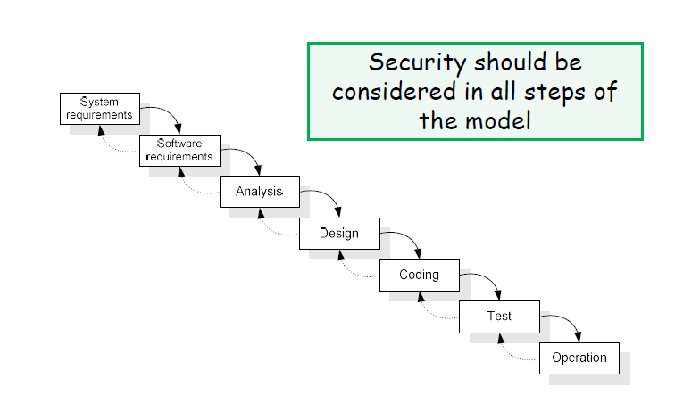
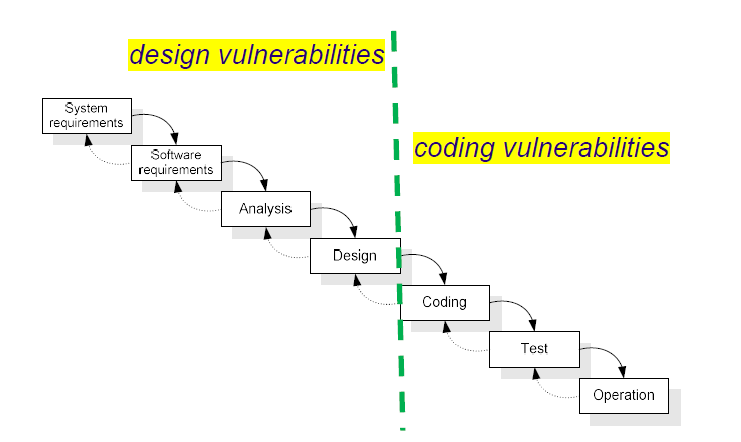
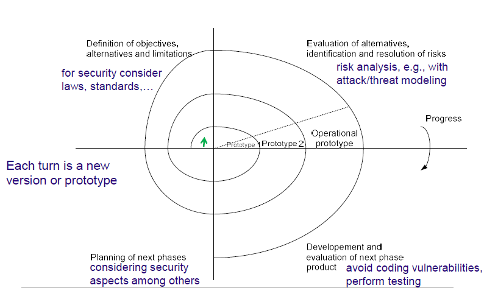

# Software Development

## Security vs. Other Development Goals

The goals of security are often contradictory with other objectives of software development:

- **Functionality**: more is better
- **Usability**: easier the better  
- **Performance**: higher the better
- **Simplicity**: more is better
- **Time-to-market**: faster the better

---

# Risk

Risk is the potential for loss, damage, or destruction of an asset as a result of a threat exploiting a vulnerability. In the context of information security, risk is often assessed based on the likelihood of a threat exploiting a vulnerability and the potential impact of that exploitation. Typically, the objective is (not to achieve 100% security, or 0
vulnerabilities, but) to have an acceptable risk level, which is a balance between the cost of implementing security measures and the potential impact of a security breach.

- **Probability of successful attack** = Threat level x Vulnerability level
- **Risk** = Probability of successful attack x Impact

The Risk depends on the system evironment:

- All software is 100% secure in a computer locked in a safe with no Internet connection
- basic arithmetic: T*0*I=0 0*V*I=0 T*V*0=0

## Factors Affecting the Vulnerability Level

The main factors affecting the vulnerability level are:

- The kinds of vulnerabilities that exist in the software (design/coding/operational)
- The implemented security mechanisms
- Maturity level of the software development processes used in the company like:
  - Code reviews and security assessments
  - Standardized security practices
  - Regular testing and validation
  - Documentation and change control
  - Security training for developers
- Uncertainty of the above factors.

---

# Software Development Life Cycle (SDLC)

A Software Development Life Cycle (SDLC) is a formal or informal **methodology** for **designing**, **creating**, and **maintaining** software. 
Many SDLC models do **not** address software security, but it is important to consider security at every phase of the SDLC to ensure that the software is secure and resilient against potential threats.

Secure software development practices usually need to be added to and integrated within each SDLC model to ensure the software being developed under that model is well-secured.

## Waterfall Model

The Waterfall Model is a linear and sequential approach to software development. In this model, each phase must be completed before the next phase can begin. The phases typically include:

1. **System Requirements**: Define the overall system requirements, including hardware and software specifications.
2. **Software Requirements**: Specify the software requirements in detail, including functional and non-functional requirements.
3. **Analysis**: Analyze the requirements and design the system architecture.
4. **Design**: Create detailed design specifications for the software components.
5. **Coding**: Write the actual code for the software components.
6. **Testing**: Verify that the software works as intended and is free of defects.
7. **Operations and Maintenance**: Deploy the software and provide ongoing support and maintenance.

## Spiral Model

The Spiral Model is an iterative approach to software development that combines elements of both the Waterfall Model and prototyping. The model consists of four main phases that are repeated in a spiral.

## NIST SSDF: Produce Well Structured Software

The **NIST Secure Software Development Framework (SSDF)** provides high-level practices based on established standards and guidance for secure software development that can be integrated into any SDLC methodology.

Key practices in the NIST SSDF include:

1. **Prepare the Organization**: ensure the organization’s people, processes, and technology are prepared to perform secure software development.
2. **Protect the Software**: protect all components of the software from tampering and unauthorized access.
3. **Produce Well-Secured Software**: produce well-secured software that has minimal security vulnerabilities in its releases.
4. **Respond to Vulnerability Reports**: identify vulnerabilities in software releases and respond appropriately to address those vulnerabilities and prevent similar vulnerabilities from occurring in the future.

By following the NIST SSDF, organizations can improve the security posture of their software and reduce the risk of vulnerabilities being exploited.

To produce well-structured software, the NIST SSDF recommends the following practices:

1. **During software development**, take into consideration **security requirements** and **risk information**.
   - Create threat and attack models, and analyze how to address the risks and implement mitigations.
   - Perform more rigorous assessments for high-risk areas.
   - Review vulnerability reports and statistics for previous software releases.
2. **Review** the **software design** and architecture to verify compliance with security requirements and risk information.
    - Have someone qualified who was **not** involved with the software design review to do the checks.
3. **Verify that third-party software components** (e.g., libraries, frameworks) complies with security requirements and risk information.
    - Communicate requirements to vendors, open-source communities, and third parties.
   - Use appropriate means to verify third-party software, including ensuring it is still actively maintained, especially by remediating new vulnerabilities found.
4. **Reuse** **existing**, **well-secured software** components when possible instead of duplicating functionality.
   - **Create or acquire** well-secured software and reuse it in the organization.
   - **Build in support** for using standardized security features and services, such as log management, identity management, and vulnerability management systems.
5. Create source code adhering (following closely) to **secure coding guidelines**.
   - Have someone qualified who was not involved with the software design review to do the checks.
6. **Configure** the compilation and build processes to improve executable security.
7. **Review** and/or analyze human-readable code to identify vulnerabilities and verify compliance with security requirements.
8. **Test** executable code to identify vulnerabilities and verify compliance with security requirements.
9. **Configure the software** to have secure settings by default.

Other factors that affect the security of the software include:

- Programming language used
- Closed vs. open source components

## Programming Languages

The choice of programming language can have a significant impact on the security of the software. Some programming languages are designed with security in mind and provide built-in features to help prevent common vulnerabilities, while others may be more prone to security issues. Some examples of programming languages and their security characteristics include:

- **C/C++** are fast but prone to vulnerabilities
  - Pointers usage can lead to memory corruption
  - Lack of array bounds verification
  
- **Java/C#** are not perfect but limit these problems
  - No direct pointer manipulation
  - Array bounds checking at runtime
  - Programs run in a sandbox (enforces access control policies)
  - However, there are still vulnerabilities, default policies issues, etc.
  
- **Perl** is slower but has interesting security features
  - Taint mode monitors variables at runtime to detect if untrusted user input leads to a security violation.

## Open source vs. Closed Source

There is an ongoing debate about the security implications of using open-source versus closed-source software. Both approaches have their advantages and disadvantages when it comes to security:

- **Open Source Software**:
  - **Advantages**:
    - Transparency: The source code is available for review, allowing security experts to identify and fix vulnerabilities.
    - Community Involvement: A large community of developers can contribute to identifying and fixing security issues.
    - Rapid Updates: Security patches can be released quickly by the community.
  - **Disadvantages**:
    - Variable Quality: The quality of open-source projects can vary widely, and some may lack proper security practices.
    - Exposure: The availability of source code can also make it easier for attackers to find vulnerabilities.
- **Closed Source Software**:
  - **Advantages**:
    - Controlled Development: The development process is controlled by a single entity, which can enforce strict security practices.
    - Obscurity: The source code is not publicly available, which can make it harder for attackers to find vulnerabilities.
  - **Disadvantages**:
    - Limited Review: Fewer eyes on the code can lead to undiscovered vulnerabilities.
    - Slower Updates: Security patches may take longer to be released, as they depend on the vendor's schedule.