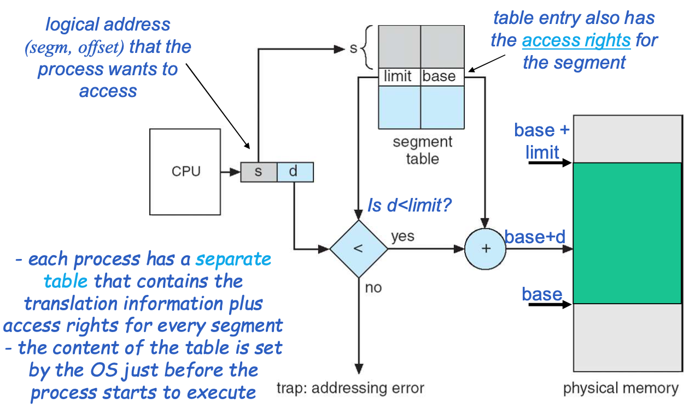
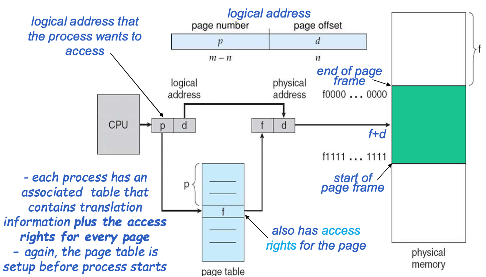
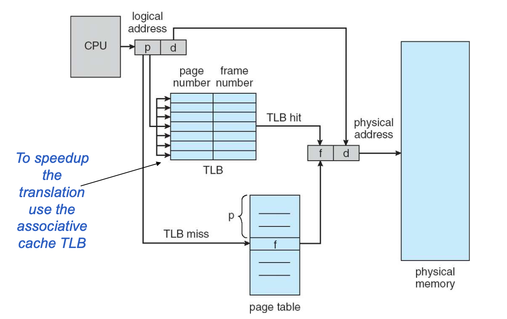
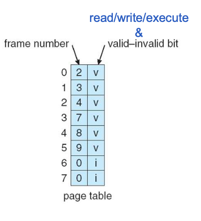
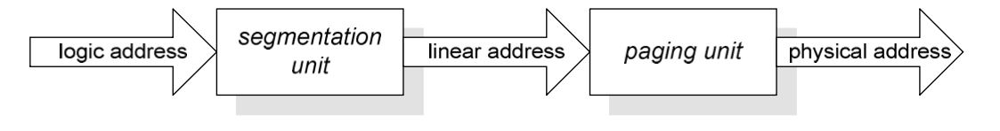
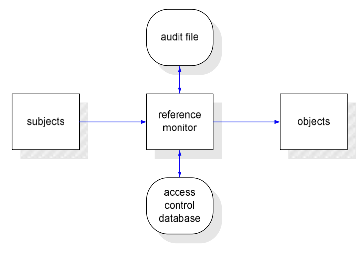
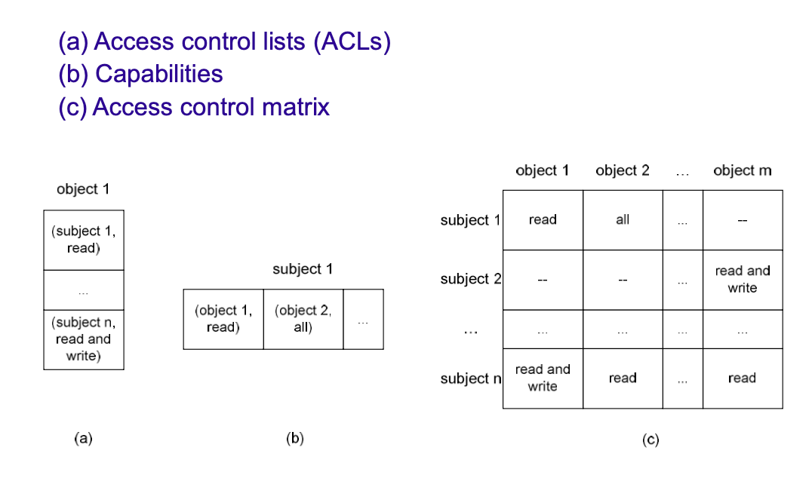
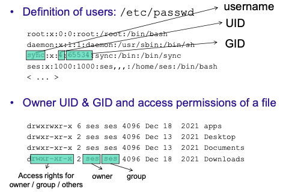
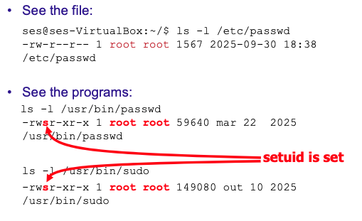

# Operating Systems Protection

The operating system (OS) plays a crucial role in protecting the computer system and its resources from unauthorized access and potential threats. OS protection mechanisms are designed to ensure the confidentiality, integrity, and availability of system resources.

Since the most modern OSs support multiprogramming, they must provide protection **among the users**, namely beteween a legitimate user and an intruder/malware, and **of the OS itself** form users, intruderes and malware.

To achieve this, OSs often need to cooperate with hardware components, to implement the protection echaniesms effectively.

---

# Protection of Resources

A computer system has various **resources**, often called **objects**, that need to be protected, including:

- **Memory**: The OS must ensure that each process has access only to its allocated memory space and cannot interfere with the memory of other processes (e.g., Memory pages and segmentats).
- **IO devices**: The OS must control access to input/output devices to prevent unauthorized use or interference(e.g., disks, networks, printers monitors).
- **Dynamic Libraries**: The OS must manage access to shared libraries to prevent conflicts and ensure that processes use the correct versions.

This objects are normally accessed by **subjects**, such as **Processes**, **Users**, or **Groups**.

The OS should ensure that these objects are only accessed by authorized subjects and that the access is controlled based on predefined policies, for example:

- Process should only have **direct** access to their own memory segments.
- Each file can/should be accessed only by a **set** of users/processes with specific permissions (read, write, execute).

The main two mechanisms used by OSs to protect resources include:

- **Separation**: Ensuring that different processes and users are **isolated from each other** to prevent **unauthorized access**.
- **Mediation**: Controlling access to resources by mediating **what kind of access is allowed**, based on predefined policies.

## Separation

The most common OS (Unix, Windows) run the sotftware in two modes(aka levels, rings):

- **Kernel mode**: The OS runs with full privileges and can access all hardware and memory (e.g., memory, I/O devices, ...).
- **User mode**: Applications run with restricted privileges, **controlled** by the OS.

This models are **enforced** by the CPU that can simply **desables a set of its instructions** in user mode thata is necessary to access the resources directly (e.g., in/out, sti/cli, hlt) where "disable" means generating or does nothing if a process tries to execute them in user mode, depending on the instruction.

When a process needs to access a resource, it must **call the OS kernel** through a **system call** so that the OS can execute the request with privileged operations on its behalf. The OS **then checks the permissions and mediates** the accesses from user mode processes to ensure that they are authorized.

### System Calls

User mode software cannot directly access system resources. Instead:

- **Software must call the OS kernel** to execute privileged operations on its behalf.
- **Two difficulties**: The OS kernel runs in kernel mode (not accessible to user mode processes), and kernel memory space is invisible to the process.
- **Solution**: Use **system calls** triggered by a special instruction (e.g., `int` in Intel CPUs) that causes a **software interruption (exception/trap)**, forcing the CPU to switch from user mode to kernel mode
- The OS executes the requested operation and returns control to the user mode process with the result.

### Memory Protection

This system calls solve the **separation** problem for most resources of the machine, but not for memory, since a process can still access memory directly by using pointers. This memory access cannot be perfomed through system calls because it leads to performance issues.

To solve this problem, theres a need for **hardware** and **OS** cooperation to implement memory protection mechanisms.

### Strategies for Separation

Some common strategies for protection include:

- **Physical separation**: Different processes use distinct devices (e.g., printers for different levels of security).
- **Temporal separation**: Processes with different security requirements are executed at different times.
- **Logical separation** (memory separation): Processes operate under the illusion that no other processes exist (e.g., using virtual memory techniques).
- **Cryptographic separation**: Processes use cryptographic techniques to conceal their data and/or computations in a way that they become unintelligible to other processes (e.g., Intel SGX/TEE).

### Separation for Memory Protection

The most used solutions for memory protection are **Segmentation**, **Paging** and a combination of both.

#### Segmentation

In segmentation, a program's memory is divided into several parts called **segments** (e.g., **code**, **data**, **stack**, **heap**, ...). Each segment has a **name** that is addressed by **(name, offset)**. This addressing allows for segments to be placed in any point of physical memory and to be **realocated** to other areas when needed, this memory can also be stored in auxiliary memory (e.g., disk).

To implement this segmentation, there is a **translation table** with the location of the **beginning** of each segment, which allows the translation of a **logical address** to a **physical address**. Due to performance reasons, this table is managed **cooperatively** between the OS and the hardware, through the CPU **Memory Management Unit (MMU)**.

**The translation table:**

- **Allows a process to access a memory cell only if** the segment where the cell is located appears in its translation table.
- **Keeps info about access rights** (e.g., READ, WRITE, EXECUTE) to the segment.
- **Every memory access must go through the OS/MMU** so access rights can be checked (e.g., no exec on data segments).
- **There can be several segments with different access rights** for different memory regions (code is executable but not writable, data is writable but not executable, etc.).
- **The OS updates the table when the executing process changes** to ensure each process has its own isolated memory view.
**Summary: Memory protection ensures:**

- A process **cannot access (read/write/execute) memory areas** that do not belong to it (other processes and the OS).
- A segment of memory **can only be accessed (read/write/exec) accordingly to the mode** indicated in the translation table, which is set up by the OS.

**Address Translation Process**

This segmentation mechanism leads to some problems, such as:

- **Checking efficiently** if memory accesses are beyond the end of the segment.
- Can cause **fragmentation of memory**, since segments can have different sizes and can be created/deleted dynamically.

#### Paging

The memory used by a process is divided in pages of the same frame size (e.g., 4KB typically a power of 2). The **physical memory** is divided into **page frames** of the same size as a page in order to avoid fragmentation and knowing the end of each page easily. This memory is addressed by **(page number, offset)** and each pages does not have logical units (e.g., code, data, stack), contrarily to segmentation.

From a **protection** point of view, pages are like segments:

- A process **sees a physical page only if** the page appears in its **page translation table**.
- **Access rights** (e.g., WRITE, EXECUTE) are stored in each table entry, and access rights are **enforced per access**
- **The table is updated by the OS** when there is a process switch to maintain isolation between processes

**Address Translation Process**

**Address Translation Process TBL**

The memory protection is implemented by associating a few bits to each frame, and keeping them updated in the corresponding table entry:

- **Valid bit**: Associated page is valid, i.e., belongs to the process address space.
- **Read-Only, Read-Write and Execute-Only bits**: Indicate the allowed operations on the page (e.g., read, write, execute).

#### Segmentation + Paging

Several architectures support both segmentation and paging, (e.g., Intel x86 with 32 bits).

As an example, Linux in x86 32 bits uses Segmentation with paging:

- The programs use ***logical addresses*** composed of:
  - **Segment selector** (16 bits) stored in a CPU register (CS, DS, SS).
  - **Offset** (32 bits).
- Converted by the MMU to ***linear address*** to the virtual memory, splitted in 4KB **pages** (32 bits).
- Converted by the MMU to ***physical address*** if the page is not in RAM, then a ***page fault*** is generated.

#### Linux x86: Segmentation

In Linux x86, **each process** (&kernal)  has different **segment selectors** in registers, meaning that the OS must update the COU registers in every context switch.

The segment selector contains 2 bits to indicate the **Current Privilege Level (CPL)** of the CPU (only 2 levels are used: 0 - kernel mode, 3 - user mode).

The information about each **segment** is stored in two tables:

- **Global Descriptor Table (GDT)**: Contains the segments used by the OS and all processes (e.g., kernel code and data segments).
- **Local Descriptor Table (LDT)**: Contains the segments used by a specific process (e.g., user code and data segments).

The **segment descriptors** in those tables have 64 bits, and contain:
- **Type of Segment** (4 bits): Code, Data, ...
- **Linear Base Address** (32 bits): Starting address of the segment in linear memory.
- **Size of Segment** (20 bits): Size of the segment in bytes.
- **Descriptor Privilege Level (DPL)** (2 bits): Privilege level required to access the segment. The access is granted if CPL ≤ DPL (if DPL = 0, the segment can only be accessed by the kernel).

## Mediation through Access Control

**Objects** are accessed by **subjects** (e.g., users, groups, processes) that must be authorized to access them.

After implementing separation mechanisms, we need to mediate the subject's accesses to ensure that only authorized actions are performed on the objects. This is achieved through **access control**.

**Access Control** is concerned with the **validation of the access rights of subjects** when performing operations in the resources of the system.

The OS must **mediate** these accesses based on predefined policies to ensure that only authorized subjects can access the resources, and that they can only perform the operations they are allowed to perform.

### Referece Monitor

The access control is implemented through a **Reference Monitor**, that consists in abstrct components that mediate all accesses to objects by subjects. This monitor must satisfy the following properties:

- **Completeness**: All accesses to objects must go through the reference monitor and must be impossible to bypass it.
- **Isolation**: The reference monitor must be protected from tampering by subjects, ensuring its integrity.
- **Verifiability**: The reference monitor must be small and simple enough to be verified through analysis and testing.

### Basic Models for Access Control

**Access Control Lists (ACLs)**
- Each object is associated with a list of pairs (subject, rights)
- The list contains which subjects can access the object and what rights they have
- Efficient for managing access to a specific object

**Capabilities**
- Each subject has a list of objects that it may access
- The list contains capabilities, i.e., pairs (object, rights)
- Capabilities are cryptographically protected against modification and forging
- Efficient for managing what a subject can access

**Access Control Matrix**
- A matrix with lines per subject, columns per object, and rights in the cells
- Provides a complete view of all access rights in the system
- Subjects are rows, objects are columns, and cells contain the access rights (read, write, execute, etc.)

### Unix Access Control Model I

In Unix each **user** has a **username** associated to an **account**, and each account has a unique **User ID (UID)**. Users can be grouped into **Groups**, each with a unique **Group ID (GID)**. Each user belongs to one primary group and can belong to multiple secondary groups.

UID 0 - **Superuser (root)**: Has (almost) unrestricted access to all system resources.
Early Unix: initial GID = 100 (Group "users")
Today Unix: initial GID = UID (Group with the same name as the user)

Each object (file, directory, device, ...) has associated:

- An **owner** UID and a GID.
- An **access permissions** mask rwx (read, write, execute) for owner, group, and world (9 bits).

### Unix Access Control Model II

Objects are accessed by **processes** (i.e., running programs):

- The **effective UID (EUID)** and the **effective GID (EGID)** are compared with the object permissions to grant/deny access.
- The question asked is: Does process with EUID=N1 and EGID=N2 have permission to do action X in this object?
- Typically EUID = real UID and EGID = real GID, but this can change with special permission bits.

**Two More Access Bits: setuid, setgid**

These bits serve to allow access to resources the user normally cannot access:

**Example: `/etc/passwd` & `/etc/shadow`**

- These files must not be modified arbitrarily.
- They are owned by root.
- A user modifies its entry using a program called `passwd` that must run as root.
- How? The `passwd` program has **setuid root**.
- This means that when a user runs `passwd`, the **effective UID (EUID) of the process is 0** (root) ≠ user's real UID.
- The process temporarily gains root privileges to modify the password files.

**Security Implication:** Privilege escalation attacks often aim programs with setuid and owner UID 0! These programs are high-value targets because they run with elevated privileges.

### Unix Access Control Model III

The main ideal is about applying the **principle of least privilege** when developing software:

- Execute **privileged** operations in the **beginning** then **reduce the privileges** (e.g., set EUID to user's real UID).
- Devide the software in components and **run only minimal components with high privileges**
- Change the execution enviroment with **chroot** to limit the files a process can access.
  - Changes the root directory allowing the program to use only files bellow the new root.
  - Hard to put to work since all files (e.g., libraries) must be bellow the new root.
  - Some  programs must use `/dev/null`, `/dev/random`, ...

### Access Control Models: DAC/MAC

**Discretionary Access Control (DAC)** - Configured by the user (traditional Linux solution).
**Mandatory Access Control (MAC)** - Configured by the administrator **for all systems**.

**Example of MAC**

**POSIX standard** was being extended with more fine-grained privileges: **capabilities** (careful: **not the usual meaning of
capabilities**) (was, no longer!, but Linux implemented existing draft)

Linux has an implementation based on bitmaps:

- **Effective Capabilities (E):** **checked** to determine if operation can proceed when there is an attempt to preform a privileged operation (instead of EUID = 0).
- **Permitted Capabilities (P):** Capabilities that a process may use; usually, P = E but the program **may remove** some capabilities from E to restrict operations.
- **Inheritable Capabilities (I):** Capabilities **given to child** processes of this process (fork).

Example of capabilities: `CAP_KILL` (send signals), `CAP_NET_RAW` (use raw sockets), ...

## Additional Memory Protection Mechanisms

### DEP - Data Execution Prevention

**Data Execution Prevention (DEP)** marks memory regions as non-executable, such that an attempt by an attacker to execute machine code in these regions will cause an exception and process termination.

**The Attack Scenario:**
- A user provides input to a program not as a string but as a piece of code/data segment
- If the user finds a way to force execution of that code, they can execute arbitrary code while abusing privileges in the program

**Protection:**
- DEP can be enforced with **hardware support**, such as the **NX bit (no-execute bit)**, or in some cases **software emulation** of these features
- Prevents execution of code in data segments (stack, heap)

### ASLR - Address Space Layout Randomization

**What if an attacker can break the DEP protection?**

An attacker might:
1. Find some existing code in memory that changes the segments/pages permissions
2. Call that code and modify the permissions of the stack/heap to make it executable
3. Finally, call their malicious code

**ASLR Protection:**

To prevent an attacker from reliably jumping to a particular exploited function in memory, **ASLR randomly arranges the address space positions of key data areas** of a process, including:
- The base of the executable
- The positions of the stack
- The positions of the heap
- The positions of libraries

This makes it significantly harder for attackers to predict memory addresses and execute successful attacks, as the layout changes with each execution.

---

# 
