# Buffer Overflows

A **buffer overflow** is a vulnerability that ahs been found in the heartbeat protocol implementation of TLS (Transport Layer Security) and DTLS (Datagram Transport Layer Security) of OpenSSl. OpenSSL replies a requested amount up to **64 kB of random memory content** as a response to a heartbeat request. Sensitive data such as message contents, **user credentials**, **session keys and server private keys** have been observed within the reply contents. More memory contents can be obtained by sending multiple requests. The attacks have **not been observed to leave traces in application logs**.

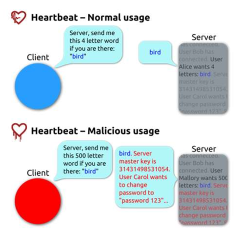

## What is a Buffer Overflow?

In a C programs stores data in 4 different memory segments:

- **Stack** - local variables and function call management
- **Heap** - dynamically allocated memory (malloc, new)
- **Data segment** - global and static variables
- **BSS segment** - uninitialized global and static variables

A **buffer** consists in a contiguous block of memory that holds multiple instances of the same data type. A **buffer overflow** occurs when a program writes (or reads) outside the allocated space for the buffer, **normally after** the end (bit **can also occur before** the beginning of the buffer).

## Cause

Languages like C and C++ does not perform **automatic bounds checking** on arrays and buffers. This means that if a program writes more data to a buffer than it can hold, the excess data will overwrite adjacent memory locations. This can lead to **undefined behavior**, crashes, or security vulnerabilities. Besides that, **programers usually make assumptions** like "the user never types more than 1000 characters as input", which can lead to buffer overflows if the user provides more data than expected. 

## What does a Buffer Overflow do?

When a program has a buffer overflow vulnerability, the program becomes unstable, crashes, or behaves aparently normally. This leads to side effects depending on:

- How much data is written beyond the buffer's boundaries.
- What data is overwritten (e.g., control structures, function pointers, return addresses).
- Whether the program tries ti read overwritten data.
- What data ends up replacing the memory that gets overwritten.

## Why are Buffer Overflows a Security Problem?

BOs in the worse case, can be exploited intentionally and let the attacker **execute its own code** on the target system. The main obective is usually to run code with superuser privileges, that is easy if the server runnig with superuser previliges or the attcker can use a **privilege escalation** exploit after gaining access to the system.

**Other ways where Buffer Overflows can cause security problems:**

- **Code might be modified**: Overwriting executable code in memory can change program behavior, allowing attackers to alter the program's logic or inject malicious functionality.
- **Data may be altered**: Buffer overflows can overwrite critical data structures (e.g., function pointers, configuration values, security flags), changing program behavior and potentially bypassing security checks.
- **Data might be read**: Creating an **information leak** where sensitive data (passwords, encryption keys, personal information) stored in adjacent memory can be read by the attacker, compromising confidentiality even without executing malicious code.

A simple way to prevent this kind of attacks is to allways check the size of the input data before copying it to a buffer.

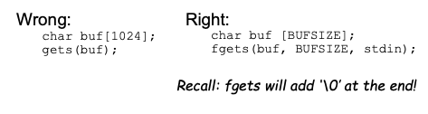

## Overflowing the Heap and Stack

The memory virtualization is typically solved using **segmentation** and **pagination** mechanisms (80x86 processors support both).

A program stores data in several memory segments:

- **Global variables** - data/bss segments.
- **Local variables** - stack segment.
- **Dynamically allocated memory** - heap segment.

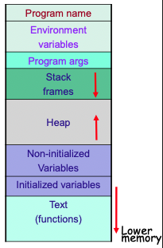

# Heap Overflow

A **heap overflow** occurs when a program writes more data to a dynamically allocated buffer in the heap than it can hold, overwriting adjacent memory regions.

## Basic Heap Overflow Attack

**Attack mechanism:**

1. **Modify value of data in the heap**: An attacker can overflow a buffer (e.g., `str`) to overwrite data stored in adjacent heap memory (e.g., a `critical` variable).

2. **Example scenario:**
   ```c
   char *str = (char *)malloc(7);
   char *critical = (char *)malloc(7);
   strcpy(critical, "secret");
   strcpy(str, argv[1]); // vulnerability - no bounds checking
   ```

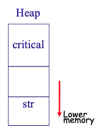

3. **Memory organization in heap**: Both `str` and `critical` are allocated sequentially in the heap. If `str` receives more than 7 bytes of input, it will overflow into the memory space of `critical`, overwriting its content.

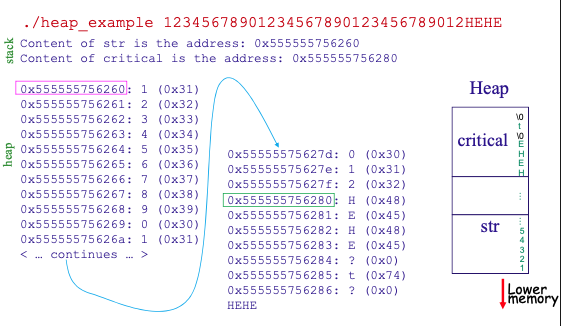

## Limitations of Heap Overflow Attacks

**Important constraint:** Although heap overflow attacks can be significant, they have limitations:

- We are **limited to write to higher memory zones** than the buffer (overflow moves forward in memory)
- We **probably cannot write too far above the buffer** because:
  - We need to overwrite the **whole memory in between** the buffer and the target
  - There might be **unallocated memory pages** in between, which would cause the program to crash with a segmentation fault before reaching the target
  
This means heap overflows are typically effective only when the target data structure is located immediately after the vulnerable buffer in memory.

# Stack Overflow

The most common type of Stack Overflow attack is the **stack smashing attack**.

```c
void test(char *s) {
    char buf[10]; //Note: gcc may store extra space
    strcpy(buf, s); //does not check buffer’s limit
    printf(" s = %p\n &buf[0] = %p\n\n", s, buf);
}
main(int argc, char **argv) {
    test(argv[1]);
}
```

**The code is obviously vulnerable:** It inserts untrusted input into a buffer without checking the size, allowing an attacker to overflow the buffer and potentially overwrite adjacent memory.

## Stack Organization and Assembly

When **gcc compiles this code**, it first translates it to **assembly language**, which reveals how the stack is organized and where vulnerabilities can be exploited.

**Key x86-64 Registers (AT&T notation):**

- **RSP (Stack Pointer)**: Points to the top of the stack.
- **RBP (Base Pointer)**: Points to the beginning of the current stack frame.
- **RIP (Instruction Pointer)**: Points to the next instruction to execute; holds the return address.

**Stack Frame Structure:**

When `test()` is called, the stack is organized as follows (stack grows downward in memory):

```
[Higher memory addresses]
    argv[1] = s          ← argument passed to function
    ret address          ← return address (saved RIP)
    saved rbp            ← saved base pointer from caller
    buf[10]              ← local buffer (overflow starts here)
[Lower memory addresses] ← RSP points here
```

**The Attack:**

1. The `strcpy(buf, s)` copies `argv[1]` into `buf` without bounds checking
2. If `argv[1]` is longer than 10 bytes, it overflows `buf`
3. The overflow can overwrite:
   - **saved rbp** (saved base pointer)
   - **ret address** (return address) - **Critical target!**
4. By overwriting the return address, an attacker can redirect execution to arbitrary code when the function returns

**Review of Assembly (64-bit x86; AT&T notation)**

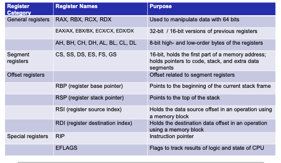
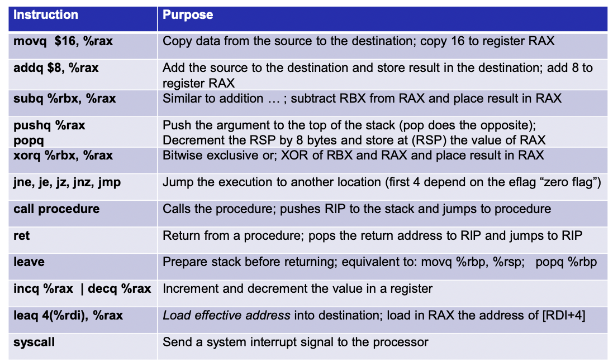

**Review of Assembly (32-bit x86; AT&T notation)**

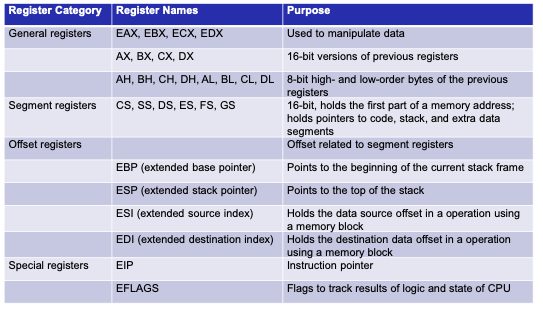
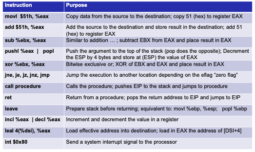

**Other Relevant Info**


## Stack Overflow (III): Running the Example

- Supplying a short input (e.g., `12345`) overflows `buf` and overwrites saved `rbp` and part of the return address, but may still return and print values
- Supplying a longer input (e.g., `12345678901`) overflows further and corrupts control data, typically causing a segmentation fault (core dump) when returning
- Key takeaway: overflow grows upward in the stack frame (toward saved `rbp` and saved `rip`)

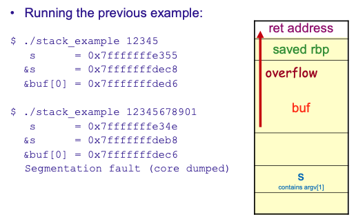

## Stack Overflow (IV): Redirecting Execution

- Example introduces a `cannot()` function that should not run
- By placing the address of `cannot` over the saved return address, the function returns into `cannot`, proving control-flow redirection
- Demonstrates how overwriting the saved `rip` transfers control after `test` returns

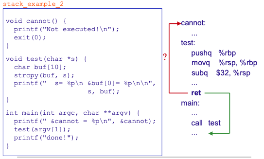

## Stack Overflow (V): Crafting an Exploit Payload

- Build an input buffer that fills `buf`, overwrites saved `rbp`, and writes the target address into the saved return slot
- Example payload: array with the address of `./stack_example_2`, followed by padding and the target address; `execve` runs the program with that crafted argv
- Result: when `test` returns, execution jumps to the injected address (e.g., `cannot`) instead of the legitimate caller


## Stack Layout

**64-bit x86 Stack Layout**
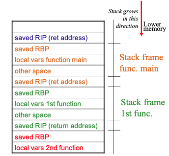

**32-bit x86 Stack Layout**
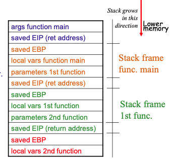

## Pratical Aspects

In order to find out the place of the return address that has to be overwritten by the BO whithout the source code, the attacker goes by trial and error or reverses engineering the code. 

## Code Injection

### x86-64 

In Unix, the code to span a shell is:

```c
char *args[] = {"/bin/sh", NULL};
execve("/bin/sh", args, NULL};
        1           2      3
```

The corresponding assembly code is:

```assembly
xor %rax, %rax ; %rax = 0
3 movq %rax, %rdx ; %rdx = envp = NULL
2 movq $address_of_argv, %rcx ; %rcx = args
1 movq $address_of_path_string, %rbx ; %rbx = prog
movq %rcx, %rsi ; %rsi = %rcx = args
movq %rbx, %rdi ; %rdi = %rdx = prog
movq $0x3b, %rax ; syscall number for execve()
syscall ; do syscall
```

### x86-32

In Unix, the code to span a shell is:

```c
char *args[] = {"/bin/sh", NULL};
execve("/bin/sh", args, NULL};
        1           2      3
```

The corresponding assembly code is:

```assembly
xor %eax, %eax ; %eax = 0
3 movl %eax, %edx ; %edx = envp = NULL
2 movl $address_of_argv, %ecx ; %ecx = args
1 movl $address_of_path_string, %ebx ; %ebx = prog
movl $0x0b, %al ; syscall number for execve()
int $0x80 ; do syscall
```

## Internal Buffer Overflows

BO can also occur not only in the user code, but also in the buffers of any module linked to the program, such as a library function.

**Example:** `char *realpath(const char *path, char *out_path)`

- Converts a relative path to the equivalent absolute path.
- Problem: output string may be longer than the buffer provided.
- Even if the size of `out_path` is `MAXPATHLEN`, an internal buffer could be overrun.

**Other functions with similar problems:** `syslog`, `getopt`, `getpass`, ... (NOTE: Current implementations of these functions most probably no longer contain these problems!)

## Other Risks

Even "safe" versions of lib calls can be misused, for example, `strncpy()` has typically an undelined behavior if the two buffers overlap or if the original string is larger than the destination buffer this function does not null-terminate the destination string.

## Main Solutions for Protection

1. **Address Space Layout Randomization (ASLR)** - the starting address of the address space segments changes in each execution.
2. **Data Execution Prevention (DEP)**  (also called W Ꚛ X, where W = write; X = execute) - the stack pages cannot be executed, but only read/written, and the code segment can be executed, but not written.
3. **Canaries** - put special (nondeterministic) values (canaries) before (or after) the places we want to protect in memory, and check that they have not benn changed before accessing the protected memory.

## Stack Canaries

The **Stack Canaries** are normally active by default in most sytems; they place a canary (random value) right before the stored RBP and RIP, to detect buffer overflows on the stack attempting to corrupt the RIP to change the execution flow.

**x86-64**

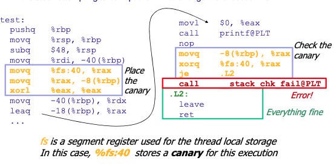

**x86-32**

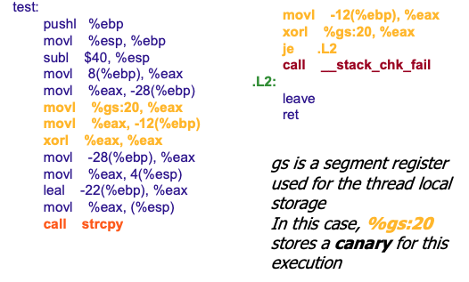

## Control Flow Integrity (CFI)

The CFI **restricts the control-flow** of an application to valid execution traces only, and enforces this property by **monitoring the program at runtime** and comparing its state to a **set of precomputed valid states**. If an invalid state is detected, an alert is rasied and the program is terminated.

A **control-flow hijack attack** redirects the control-flow of an application to locations that could not be reached in a benign execution of the program. Example, to the injected code or to code that is reused in an alternate context. The CFI can detect these attacks by **limiting the targets of control-flow transfers**.

Depending on the implementation, some techniques can bypass CFI:

- Find an indirect call that was not protected by CFI (either CALL or JMP).
- Use a controlled-write primitive to overwrite an address on the stack (since the stack is not often protected by CFI).
- Set the destination to the code located in a non-CFI module loaded in the same process.

# Advanced Overflow

Shell code includes zeros: 

- Functions like `strcpy()` stop processing when the first zero is reached.
- **Substitute** places where zeros appear **with equivalent code**.
- Example: `mov $0, %eax` can be replaced with `xor %eax, %eax` (sets `%eax` to zero without using a zero byte).

The Lack of space: **reduce code** or **provide it at an earlier time** so that it is available when needed (e.g., environment variables) or **look for the code** in the program/libraries.

Discover the address where the code is injected: for example, the return address must be superseded with this address; Use first an **information leak vulnerability** to get data that allows the calculation of this address.

Escape several forms of protection (e.g., non-executable stack; stack canaries)

## Arc Injection or Return-to-libc

**Difficulty:** The stack **cannot** be executed (DEP/NX protection).
**Assume:** **no** stack canaries or ASLR.

**Concept:** Insert a new arc in the program's control-flow graph by overwriting the return address to point to code **already in the program** — often to library functions like `system()`.

**Attack mechanism:**

1. **Overwrite the return address**: Set the saved RIP in the stack frame to point to a target function (e.g., `system()` from libc).

2. **Prepare function arguments**: Register or stack values must be set up to match the calling convention:
   - For `system(const char *command)`, ensure the register/stack holding the command pointer (e.g., RDI in x86-64) points to an attacker-supplied string in memory.
   - This string is typically placed within a writable buffer (e.g., in the stack or a data segment).

3. **Control flow hijack**: When the vulnerable function returns via `ret`, the CPU pops the overwritten return address and jumps to the target function, bypassing code-injection restrictions.

**Advantages over shellcode injection:**

- No need for executable stack (already bypassed DEP/NX).
- Leverages existing library functions; no custom shellcode required.
- Can chain multiple function calls (Return-Oriented Programming / ROP) for complex attacks.

**Limitations:**

- Requires knowledge of target function addresses (defeated by ASLR without info leak).
- Must maintain a valid stack frame or respect calling conventions to avoid crashes.

## Return-Oriented Programming (ROP)

**Assume:** **no** stack canaries or ASLR.

- Think about **various forms of code** in the address space of a process like program, libraries, etc. 
- Think about the many places where there are **returns** in that code. Each return instruction can be used to jump to another piece of code.
- Think about the **code immediately before the return**.

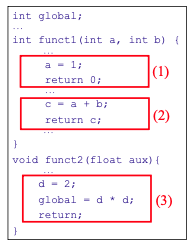

Now, **select and reorganize those pieces of code** in order tho get a relevante program. Recall that **registers will be reused** across functions, for instance, in math operations.

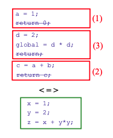

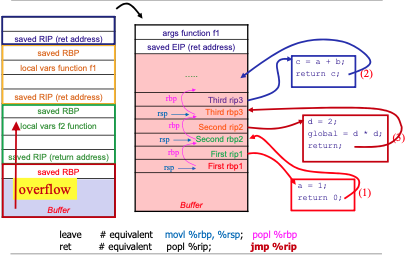

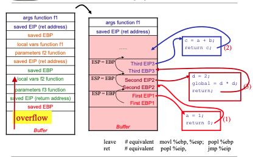

## Example: CFI (Implementation of Intel/gcc)

**Intel's Control-Flow Enforcement Technology (CET)** offers protection against ROP attacks and also call-jump-oriented programming (CJOP) attacks, which manipulate indirect control-flow to reuse existing code for malicious purposes.

**Shadow Stack:** The processor maintains a separate "**shadow stack**" that stores return address. When a function returns, the address on the shadow stack is compared to the one on the main stack. If they differ, it indicates an attack, and the processor halts execution.

**Indirect Branch Tracking (IBT):** This feature ensures that indirect calls and jumps **only target a valid specially marked instruction** (`endbr64` for 64-bit mode). This prevents attackers from redirecting control flow to arbitrary code.  

**Note**: It is being deployed in newer Intel processors.

## Heap Spray

**Difficulty:** do not have a precise memory location to jump.

The attacker has managed to exploit a vulnerability but cannot find the precise address where the shell code is placed. It is therefore common to **spray large regions of the heap** with a single byte that translates to a valid instruction such as NOP (No Operation called **NOP sled**) followed by the actual shell code.

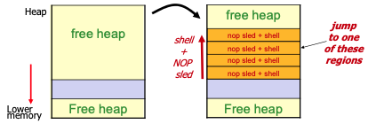

When the attacker overwrites the return address, it can point to any address within the sprayed region. The CPU will execute NOP instructions until it reaches the shell code.

## Modify a Pointer

**Difficulty:** do not have a precise memory location to jump.

In general, this kind of exploit involves **modifying a pointer** to some extent, that the actual implementation dependes on how the compiler lays out local variables and parameters in the stack frame.

**Examples:**

1. **Function-pointer clobbering:** Modify a funtion pointer to point to the attacker's supplied code.
2. **Data-pointer modification:** Modify address used to assign data.
3. **Exception-handler hijacking:** Modify the pointer to an exception handler to point to the attacker's code.
4. **Virtual pointer overflow:** Modify the C++ virtual funtion table associated with a class.
5. **Leverage from Malloc:** Resort to `malloc` implementation specificities.

### Function-Pointer Clobbering

Modify a **function pointer** to point to the code desired by the attacker (e.g., supplied by him)


Note that the return address from func does not have to be changed.
This combines well with other techniques such as return-to-libc (e.g., overflow **f** with pointer to `system()`).

### Modify a Data-Pointer

A pointer used to assign a value is controlled by an attacker for an **arbitrary memory write**.

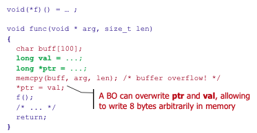

The return address from func does not have to be changed.
Notice that the variable with function pointer **f** is nt local, thus it is not prone to funtion pointer clobbering. But with the data-pointer modification, **f** can be modified.

### Exception-Handler Hijacking

When and exception is generated (e.g., access violation), Windows Structured Exception Handling (SEH) mechanism examines a linked list of exeption handlers discriptors, then invokes the corresponding handles (funtion pointer). This list is stored in the stack, so it can be overrun.

**Attack:**

1. The adderesses of the handlers are substituted by pointers to attacker-supplied or other places (e.g., libc).
2. An exception is caused in some way (e.g., writing over all the stack causes an exception when its base is overwitten).

**Note:** Some validity checking of the SEH is done since Windows Server 2003, making this attack more difficult.
**Note 1:** In Linux are also used lists of pointers, either in the heap or stack, that could also be exploited in a similar way. 

### Virtual Pointer Overflow

Virtual funtions are used in C++ to allow a child class to redifine a function inherited from the mother class. Most of C++ compilers user **virtual method table (VTbl)** associated with each class:

- VTbi is an array of pointers to methods.
- An **object** has in its header a **virtual pointer (VPtr)** to its class VTbl.
- An attacker can overrun the VPtr of an object with a pointer to a mock VTbl (with pointers to attacker-supplied, libc, ...).

```c
void method(void * arg, size_t len)
{
    char *buf = new char[100];
    C *ptr = new C;
    memcpy(buf, arg, len);  // buffer overflow!
    ptr->vf();              // call to a virtual function
    return;
}
```

### Modify Pointers Throught Malloc

#### Part I

**Problem (for the hacker):** heap implementations vary much.

- `malloc` gets a block of data.
- `free` releases a block of data (typically only marks it as free).

**Free blocks** usually chained using a double-linked list. This blocks are usually stored with control data inline: Size, link to next free, free/in-use flag, ...

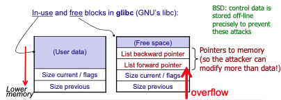

#### Part II

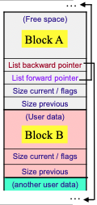

Assume that the **block A** is free, and we will **overflow the block B**, when the program frees the block B, it is typically merged with contiguous free blocks (A) to create a larger free block by:

1. **The already free block buffer (A) is removed from the free list.**
2. The control informationin the new free block (e.g., size) (B) is updated to represent the merged of two/three free blocks.
3. The new free block is inserted in the free list.

Notice taht in typical implementations of `malloc`, the top block does not even have to be free since we can make it look free with the overflow (by changing the flads of A).

#### Part III

Overflow (on B):

- Marks top block as free (changing its flags).
- Writes over forward and backward pointers.

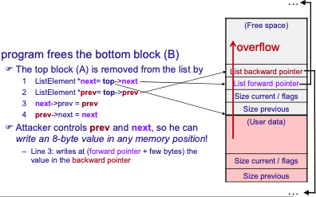

### Summary: Impact od Modifying a Pointer

The attackers overwiting an 8.bytes value in memory can lead to:

- **Modify security-wise relevant data values** in memory  (e.g.,
flag indicating the user is authenticated).
- Cause and **information leak** (e.g., by changing a string pointer that is about to be printed).
- Cause a **jump to an arbitrary address** in memory, by overwriting addresses of routines at:
  - Exit handlers.
  - Exception handlers.
  - Function pointers in the application.
  - The Procedure Linkage Table (PLT).
  - ...

Arbitrary pointer write in memory => often allows full program control.

## Use-After-Free 

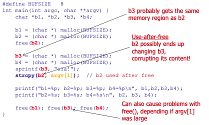

This vulnerability occurs when a program continues to use a pointer after has been freed, with causes problems related to:

- Error conditions and other exceptional situations.
- Confusion over which part of the program is responsible for freeing memory.

**Impact:**

- **Integrity:** Use of previously freed memory may **corrupt valid data**, if the memory area was allocated and used properly elsewhere.
- **Availability:** If (`malloc`) chunk consolidation occurs after the use of previously freed memory, the process **may crash** when invalid data is used as chunk information.
- **Arbitrary Execution:** If malicious data in inserted before chunk consolidation can take place, it may be possible to take advantage of the malloc **write-what-where primitive** to execute **arbitrary code**.

## Off-by-one Errors

```c
int get_user(char *user) {
    char buf[1024];
    if (strlen(user) > sizeof(buf))
        handle_error ("string too long");
    strcpy(buf, user);
}
```

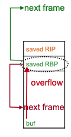

The BO of (`\0`) if the user has (1024 chars + `\0`):

- Is this exploitable? Only 1 byte can be overwritten.
- Saved `rbp` has 8 bytes; x86 is little-endian, so the least-significant byte (LSB) is at the lowest address and may be set to `0`.
- **Effect:** saved `rbp` is reduced by 0–255 bytes.
- **Consequence:** it can be as if the next frame begins inside `buf`; caller local variables or arguments can be modified.
- **Epilogue behavior:** when the function returns, `rsp` becomes equal to `rbp`, and then the return address is popped into `rip` from the shifted location, potentially crashing or altering control flow.

# Downcating Overfows

A **Type Cast** operator is a unary operator that forces one data type to be converted inte another data type. C++ suports four types of casting: **Static Cast**, **Dynamic Cast**, **Const Cast** and **Reinterpret Cast**.

**Upcasting:** from a derived class to its parent class.
**Downcasting:** from a parent class to a derived class.

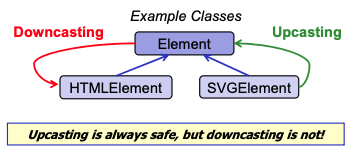

## Why is Downcasting unsafe?

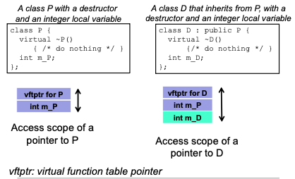

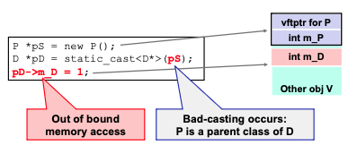

**Attack Scenario:**

1. `m_D` is actually a large amount of memory (e.g., a buffer).
2. `m_D` is on top of a vftptr of another object `V`, which you can overwrite with an arbitrary value.
3. The corresponding method of that object `V` is accessed, leading to code execution at an arbitrary address.

# Integer Overflows

The semantics of integer-handling is complex, and programmers often don't know all the details.
- This can appear in several languages, but specially in C/C++.
- E.g., what happens when a signed integer is passed to an unsigned parameter? R. 4 errors: **overflow**, **underflow**, **signedness**, **truncation**, the first two appearing also in type safe languages (Java, C#).

**Exploit examples:**

- **Insufficient memory allocation** -> BO -> attacker code execution.
- **Exessive memory allocation / infinite loop** -> DoS.
- **Attack against array byte index** -> cause a BO -> ...
- **Attack to bypass sanitizers** -> cause a BO -> ...
- **Logic errors** (e.g., modify variable to modify program behavior).
 
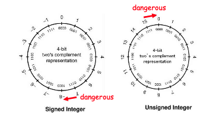

## Overflow

```c
void vulnerable(char *matrix,
    size_t x, size_t y, char val)
{
    int i, j;
1   matrix = (char *) malloc(x*y);
    for (i=0; i<x; i++){
        for (j=0; j<y; j++){
2       matrix[i*y+j] = val;
        }
    }
}
```

**1:** if overflow of `x * y`, then less than the exepected memory size is allocated.
**2:** `val` might be written to regions of memory outside of the matrix buffer.

A overflow occurs when the result of an expression exceeds the maximum value of the data type used to store it. Thypically, an overflow is handled by the system as:
```
if (x != overflow) x = x
else x = (x mod MAX_SIZE_TYPE_x)
``` 

## Underflow

Result of the expression is smaller than the minimum value of the type (e.g., subtracting 0-1 and storing the result in an unsigned int). This type of error is less common since its only possible with subtraction.


**Netscape JPEG comment length vulnerability:**

```c
void vulnerable(char *src, size_t len){
    size_t len_real; // unsigned data type
    char *dst;
        if (len < MAX_SIZE) {
1       len_real = len - 1; // no need to save ‘\0’
2       dst = (char *) malloc(len_real);
3       memcpy(dst, src, len_real);
    }
} 
```

**1:** if `len = 0`, then `len_real = 0xFFFFFFFF`.
**2:** `malloc`probably will return `NULL` because `len_real` is treated as unsigned (and is very large).
**3:** a write will cause a crash.

## Signedness

A **signed integer** is interpreted as unsigned or vice versa, so negative values are treated as large positive values with a sign bit.

***Signed integers are typically represented in two's complement.***

- **MSB = 1** means negative value.
- **MSB = 0** means positive value.

**Linux kernel XDR vulnerability:**

```c
void vulnerable(char *src, size_t len){
    int lReal;
    char *dst;

    if (len > 1) {
1       lReal = len - 1;
        if (lReal < MAX_SIZE) {
2           dst= (char*)malloc(lReal);
            memcpy(dst, src, lReal);
        }
    }
}
```

**1:** `lReal` is negative if `len > 2^31`.
**2:** `malloc` returns `NULL` and there is a crash ...

## Truncation

Assigning an integer with a longer wigth to another shorter (e.g., assigning an int (32 bits) to a short (16 bits))

A larger packet causes a truncation -> `malloc` allocs too little space -> the code that uses the space corrupts the memory (src is larger than `lReal`).

**SSH CRC-32 compensation attack detector vulnerability:**

```c 
void vulnerable(char *src, unsigned int len) {
    unsigned short lReal;
    char *dst;

    lReal = len;
    if (lReal < MAX_SIZE) {
        dst= (char *) malloc(lReal);
        strcpy(dst, src);
    }
}
```