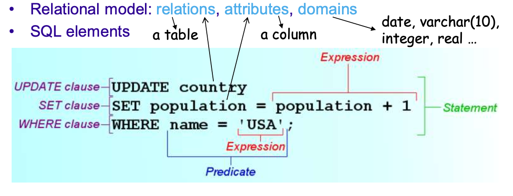
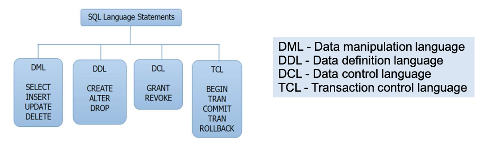
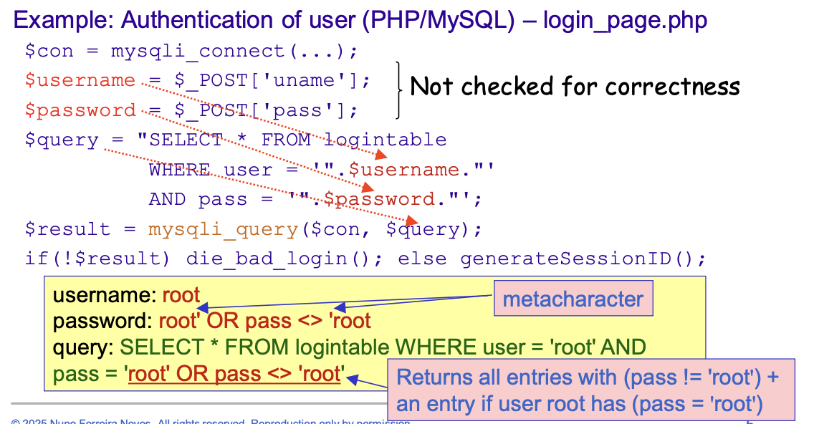
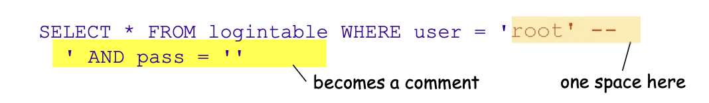
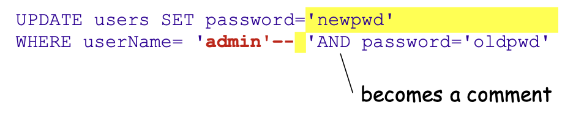
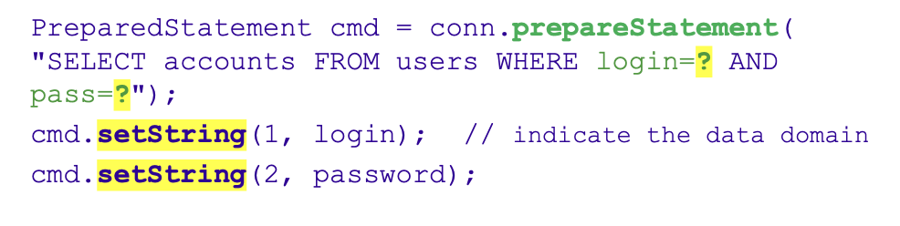
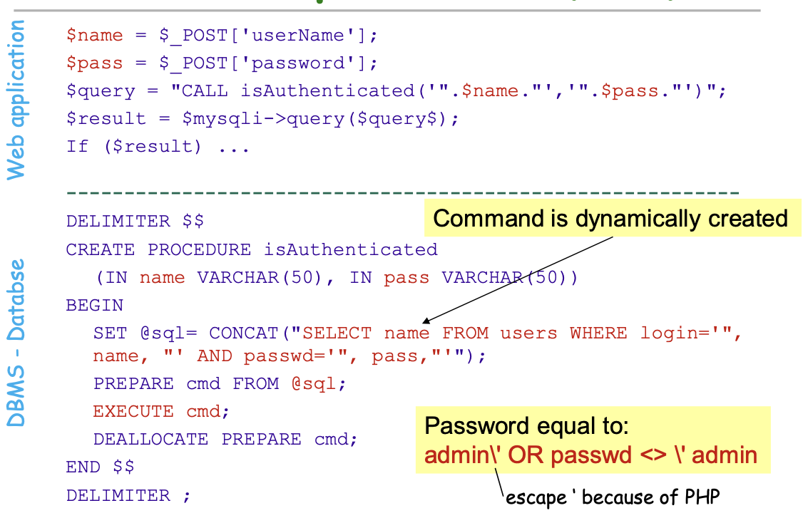

# Database Vulnerabilities

Sturcured Query Language (SQL) are languages for retrieval and managment of data in Relational Database Management Systems (RDBMS). 





# SQL Injection

The main couses for this vulnerability are that **user input** is **pasted into SQL commands** without validation or sanitization and SQL uses several metacharacters that can be used to manipulate the query.



An alternative way of getting info about root:



Avoiding metacharacter ', if the input is numeric:

```php
$order_id = $_POST['order_id'];

$query = "SELECT * FROM orders WHERE id=". $order_id;

$result = mysql_query($query);
```

Here `order_id`can be set to `1 OR 1=1` to get all orders, so the query becomes:

```sql
SELECT * FROM orders WHERE id=1 OR 1=1;
``` 

## Injection mechanisms

There are different ways for the adversary to provide malicious data to the application:

- **User input**.
- **Cookies** (can be used by the server to build SQL queries).
- **Environment variables** and **HTTP request header information**.
    ServerVariables of ASP.NET is a collection that retrieves these values. `Request.ServerVariables("CONTENT_LENGTH")`

**Note:** this problem is generic because most frameworks allow the retrieval of this kind of info.

**Second-order injection** occurs when the input is provided so that it is kept in the system (often in the database) and later used.

For example, an attacker registers as a new user called 'admin' -- and the site correctly escapes the input and accepts, later on, the attacker changes the password.



This kind of problem can occur in **any application that manages data through database**

```c
snprintf(buf, sizeof(buf), "SELECT * FROM logintable WHERE user = \'%s\' AND pass = \'%s\'", user, pass);
```

## Attack steps

1. Database fingerprinting: find the **type and version** of the database using queries that cause different responses depending on the database.
2. Discovering **database schema**: table names, column names, column data types.
3. Identifuing parameters vulnerable to SQL injection.
4. Extracting data.
5. Adding/modifying data.
6. Deleting database, tables or users.
7. **Evading detection** cleaning fingerprints and history data in the database.
8. **Arbitrary command execution**.
9. **Privilege escalation** at the level of web application or database.

Notice that the syntax of SQL injection attacks depends on two aspects:

1. The **specific DBMS** where data is stored, there are many extensions particular to each DBMS, for example:
    - **String concatenation:** MySQL and PostgreSQL use `CONCAT()` for string concatenation; SQL Server uses the **plus sign (+)** for string concatenation
      - **MySQL/PostgreSQL:**

        ```sql
        SELECT CONCAT(first_name, ' ', last_name) FROM employees;
        ```

      - **SQL Server:**

        ```sql
        SELECT first_name + ' ' + last_name FROM employees;
        ```

2. The **specific server-side** language being used.

## Preventing SQL Injection

**Parameterized SQL commands:** separate the **command** from the potentially **malicious data** that is provided at runtime and ensure that **data is only interpreted as data** and not executable code.



**Whitelisting input validation:** only accept input that matches a defined pattern.

**Input type checking:** remove malicious input and transform it into something that cannot do attacks.

**Encoding of input to something that can be trusted:** to allow input with characters that might be interpreted as metacharacters, e.g.,`mysqli_real_escape_string` in PHP (in a string that will be passed in a query to `mysqli_query`)

## 1 - Tautological

Inject code in one (or more) **conditional statement** so that it always evaluates to **true**.

**Target:** Injectable fields used in a query's `WHERE` clausein commands like `SELECT`, `UPDATE`, `DELETE`. The most common uses are to bypass authentication or extract data.

**Example:**

`login= ' or 1=1 --` (with a space in the end, makes the rest look like a comment)

**Result Query:**
```sql
SELECT accounts FROM users
WHERE login='' or 1=1 -- ' AND pass='' AND pin='';
```

## 2 - Union Query

The idea is to trick the application into returning arbitrary data by injecting `UNION SELECT <...>` statement. This only works with the `SELECT` statement and will return union of the intended data with the injected query. This requires that the **domain** and **number** of the attributes of both `SELECT` need to be the same.

**Example:**

```sql
SELECT accounts FROM users WHERE login='john' 
UNION 
SELECT cardNo FROM CreditCards WHERE acctNo=10032 -- AND pass='' AND pin='';
```

Sometimes you can address **the constriaints** on the `UNION SELECT`.

[DOMAIN] Suppose you have two tables:

- employees — with a hire_date column (`DATE`)
- candidates — with an application_date column (`DATETIME`)
  
Create a combined list of **names** and **dates**, although the date types differ.
```sql
SELECT name, hire_date AS event_date, 'Employee' AS record_type FROM employees
UNION 
SELECT name, CAST(application_date AS DATE) AS event_date, 'Candidate' AS record_type FROM candidates
ORDER BY event_date DESC
```

[NUMBER OF ATTRIBUTES] use `NULL`placeholders to make the number of columns match.

```sql
SELECT name, salary FROM employees
UNION 
SELECT access_code, NULL AS salary FROM candidates WHERE name = 'john'
```

## 3 - Piggy-Backed Queries

The idea is to add more (independent) queries that can often be injected in **any field** and allows the injection of **any** type of command. This requires DB/Sever-side logic to be configured to **accept multiple statements** in a single string (e.g., command `multi_query()` ).

**Example:** 

```sql
SELECT accounts FROM users WHERE login='doe' AND pass=''; DROP TABLE users -- ' AND pin=123
```

- `;` is the query delimiter, a metacharacter.
- Two queries are executed: the normal one and the **drop table users**.
- Others might be trivially added.

## 4 - Stored Procedures

Stored procedures are saved and executed inside the DBMS like  PL/SQL for Oracle; Transact-SQL, C# and VB.NET for Microsoft SQL Server; SPL for MySQL.

Sometimes it is **assumed** that **stored procedures ARE the solution** to avoid SQL injection attacks, but in practice, if one is not careful, sinsce the procedural language is an extention of SQL, they **might** be vulnerable to the **same attacks**.

Exploit a vulnerability while executing a stored procedure. The vulnerability can either be **SQL injection** or the execution of **commands at the OS level**, as the **procedural language may** support the **execution of OS commands** through library functions, depending on the language in which the procedure is written.

**Example:**



## 5 Illegal/Incorrect queries

The objective is to find **injectable parameters**, **DBMS type/version**, and **schema** by causing errors that reveal useful information.

- **Syntax errors:** allow the identification of injectable parameters.
- **Type errors:** support the deduction of data types of certain columns or extract data.
- **Logical errors:** often reveal names of tables and columns that caused the error.

The main **targets** are usually database configuration/management tables, and therefore are **highly DBMS specific**. This requires **capability to do SQL injection** + **verbose error messages**.

**Examples:**

**Microsoft SQL Server:** The attacker would like to run something like `SELECT * FROM sysobjects WHERE xtype = 'u'` that returns the names of the tables of the user (u).

**Type conversion:** reveals relevant data.

The attacker injects into the PIN, and the resulting query is:

```sql
SELECT accounts FROM users WHERE login='u' AND pass='p' AND pin= convert(int,(select top 1 name from sysobjects where xtype='u'))
```

Attempts to extract the name of the first user table (indicated by `xtype='u'`) from the metadata table (`sysobjects`). Then, tries to convert it to an integer (using `convert(int,...)`), which is illegal so the following error is produced:

```
Microsoft OLE DB Provider for SQL Server (0x80040E07) Error converting nvarchar value ’CreditCards’ to a column of data type int.
```
This error says type of server (Microsoft SQL Server) and name of the first table (`CreditCards`), this can be repeated to get all table names.

## 6 - Inference

The objective is the **same** as **illiga/incorrect queries**, but for a DBMS that has been protected from those attacks **by not returning any result with indicative information**. This attack attempts to **infer** if a certain condition on the state of the DBMS is true or false.

Two main techniques:

**Blind injection:**  the information is inferred by **asking true/false questions** so if the answer is **true**, the site typically **continues normally**, if **false**, the reply is **different** (although not descriptive).

**Example:**

The goal is to descover if the field **login** is vulnerable to SQL injection. The login is **vulnerable** if the next **return different output**.

```sql
SELECT accounts FROM users WHERE login='legalUser' and 1=0 -- ' AND pass='' AND pin=0 (always false)
SELECT accounts FROM users WHERE login='legalUser' and 1=1 -- ' AND pass='' AND pin=0 (always true)
```

**Timing attacks:** information is inferred from **timing delays in the response**, usually with a branch that executes a `WAITFOR DELAY` (or some other approach to introduce an artificial measurable delay, like running 1000000 times a slow function)

**Example:**

The goal is to extract the name of a table from the database.

```sql
SELECT accounts FROM users WHERE login='legalUser' and ASCII(SUBSTRING( (select top 1 name from sysobjects),1,1)) > X WAITFOR DELAY 5 -- ' AND pass='' AND pin=0
```

If the first character from the first table is greater tha X then wait.

## 7 - Alternate Encodings

Useful to cemplement other attacks but a good trick to **evade** detection mechanisms (e.g., **blacklists**) of the web application.
The ideia is to **encode input** in an unusual format: Hexadecimal, ASCII, Unicode.

**Example:**

```sql
SELECT accounts FROM users WHERE login='legalUser'; pin=
```

`char`transforms an integer or hexadecimal encoding in ASCII character, therefore, even if the word "shutdown" is included in a blacklist, the following would be executed: `exec(shutdown)`.

# Other Database Vulnerabilities

- Blank and default passwords
- Default (privileged) accounts
- Unprotected communication in virtually all DBMSs by default
- Several open ports